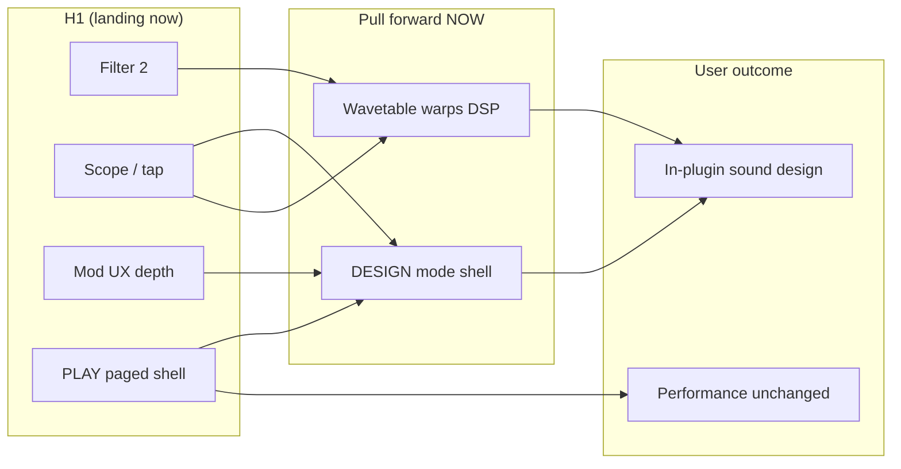

# MURMUR — DESIGN Mode + Wavetable Warps: Accelerated Implementation Plan

**Status:** PLAN (Aug 2026)  
**Scope:** Pull **Gap 1 (DESIGN mode)** and **Gap 3 (wavetable warps)** from Horizon 2/3 into the **active** development effort, parallel with Horizon 1 completion  
**Branch context:** `cursor/favorites-unison-stack-daw` — Filter 2, oscilloscope, expanded mod palette in flight  
**Audience:** Ben / engineering — concrete file paths, week estimates, exit gates  
**Companion docs:** [PRODUCT_GAP_PLAN.md](PRODUCT_GAP_PLAN.md), [UI.md](UI.md), [UI_PAGED_LAYOUT.md](UI_PAGED_LAYOUT.md), [MOD_MATRIX_PLAN.md](MOD_MATRIX_PLAN.md), [DSP_ENGINE.md](DSP_ENGINE.md), [PATCH_FORMAT.md](PATCH_FORMAT.md)

---

## 1. Strategic rationale

### Why pull these forward now (not Horizon 2/3)

Horizon 1 is delivering the **performance and feedback layer** that makes DESIGN and warps worth building immediately:

| Just-landed / in-flight (H1) | Why it unlocks DESIGN + warps |
|---|---|
| **Paged PLAY shell** (`PlayModeEditor` — Basic/Advanced/Compact, OSC/FILTER/ENV/MOD/FX tabs) | Proves tab navigation, persistent header, page switching — DESIGN reuses the same shell instead of inventing navigation twice (`UI_PAGED_LAYOUT.md` explicitly notes this) |
| **Filter 2 MVP** (`CharacterFilter.hpp`, `LayerPatch::filter2`, `FilterLfoPanel` global section) | Character filter gives post-warp tone shaping; warp presets that only hit Filter 1 sound thin — Filter 2 closes the Serum-class “wt warp → driven filter” story in PLAY |
| **Oscilloscope + audio tap** (`AudioTapBuffer`, `OscilloscopeView`, `ScopeAudioTap`) | Realtime feedback for warp auditioning and DESIGN graph commits without a separate debug build |
| **Mod UX Phase 2–3** (expanded `ModSourcePalette`, amount column, MOD tab embed via `ModLauncherPanel`, ring targets on Level/WT Pos/Pan in `OperatorEditorPanel`) | DESIGN’s full matrix is an **extension** of existing `ModRoutingOverlay` / `ModSourceStrip` / `ModAssignmentController` — not a greenfield UI |
| **Wavetable PLAY surface** (`WavetableStackView` wireframe mesh, WT POS knob, Load/browse in `OperatorEditorPanel`) | Warp knobs and DESIGN preview attach to an existing OSC page; `WavetableStackView` already interpolates frames the same way audio does |

**The competitive gap is authoring, not DSP infrastructure.** The engine already has: typed 8-node graph + compiler, 29-source mod matrix with live route publish, 762 APVTS parameters, mip-mapped wavetables, all 8 engines rendering. What blocks “sound designer never touches JSON” is **Gap 1** (structural edits) and **Gap 3** (wt timbre depth). Deferring them past H1 means shipping Filter 2 and mod depth into a synth that still requires `.pw8` hand editing for graph topology and warp motion — a poor story for Ben and for parity claims in [COMPETITIVE_ANALYSIS.md](COMPETITIVE_ANALYSIS.md).

### Synergy diagram



### Parallelization thesis

- **Warps track** is ~80% engine + schema + tests; PLAY UI is 3–4 knobs on `OperatorEditorPanel`. Can ship audible value **without** DESIGN.
- **DESIGN track** is ~90% plugin UI + processor commit paths; blocked on **nothing** in the engine except new mod destinations for warps (soft dependency).
- **Content track** (factory warp presets, graph templates) runs continuously once warp DSP exists.

**Decision:** Treat DESIGN MVP and warp MVP as **co-equal P0** starting week 1 of this plan, not sequential Horizon 2 blocks.

---

## 2. DESIGN mode — deep plan

### 2.1 Mode architecture

#### Top-level shell (new)

Introduce a **root editor** that owns mode state and delegates to child editors:

```
PatchworkEightProcessor::createEditor()
  └── MurmurRootEditor (new)
        ├── Mode toggle: PLAY | DESIGN  (chrome, persistent)
        ├── PatchBrowserBar (shared)
        └── active child:
              ├── PlayModeEditor (existing — unchanged responsibility)
              └── DesignModeEditor (new)
```

| Concern | Owner | Notes |
|---|---|---|
| Host automation (762 APVTS params) | Both modes | Same `AudioProcessorValueTreeState`; DESIGN does not bypass APVTS for automatable fields |
| Structural patch edits (graph edges, mod routes, wavetableId, FX slot type) | DESIGN primary; PLAY read-only except live mod routes | Matches [PLUGIN_ARCHITECTURE.md](PLUGIN_ARCHITECTURE.md): mod routes stay outside automation |
| Audio thread safety | `PatchworkEightProcessor` | Structural commits → `loadPatch()` + atomic engine swap; mod routes → `setModRoutesLive()` / `publishModRoutesLive()` |
| Mode persistence | Optional v1: session-only; v1.1: store in plugin state blob | Avoid blocking MVP on host chunk format debate |

#### Processor / editor split

| Operation | API | Thread | Triggers full reload? |
|---|---|---|---|
| Knob / APVTS change | Existing attachments | Message | No (ParamChangeQueue) |
| Mod route add/replace/remove | `setOrReplaceModRouteLive()` / `removeModRouteLive()` | Message | No |
| Graph edge add/remove/change | **New:** `commitAlgorithmGraphEdit(LayerPatch::algorithm)` | Message | **Yes** (`loadPatch`) |
| Wavetable assign | `setOperatorWavetableFile()` (exists) | Message | Yes |
| Wavetable frame edit (future) | **New:** `commitWavetableTableEdit()` or external file + reload | Message | Yes |
| FX slot type change | APVTS `*Type` param OR patch commit | Message | Type change may need reload if not in APVTS |

**New processor surface (MVP):**

```cpp
// PatchworkEightProcessor.h — message thread only
struct GraphEditResult { bool ok; algorithm::CompileStatus status; juce::String detail; };

GraphEditResult tryCompileAlgorithm(const algorithm::AlgorithmGraphDefinition& def) const;
bool commitAlgorithmGraph(const algorithm::AlgorithmGraphDefinition& def); // compile → patch → loadPatch
bool commitModMatrix(const core::FixedVector<modulation::ModRoute, core::kMaxModRoutes>& routes);
```

Compile preview uses the same `AlgorithmGraphCompiler::compile()` as `tools/graph_inspector/main.cpp` — DESIGN UI must never apply a graph with `CompileStatus != Ok`.

#### What PLAY keeps vs DESIGN owns

| Feature | PLAY | DESIGN |
|---|---|---|
| Algorithm topology display | `NodeSelectorRow` (compact chips) or read-only `AlgorithmGraphView` | **Editable** edge list + output-node toggles |
| Node selection → operator params | `OperatorEditorPanel` | Same panel + engine pills editable |
| Mod matrix | Partial (palette + overlay + FILTER embed) | **Full** 29×7 grid/list with amount + scope |
| FX | `FxChainStrip` — mix + PLAY params per slot | Per-algorithm **detail panels** (all `EffectSlotParams` fields) |
| Wavetable | Preview + assign + WT POS | Preview + assign + **warp panel** + (v1) import handoff |
| Filter 2 detail | Global enable + cutoff/res/drive (H1) | Same + future dual-filter routing enum |

**Hard rule:** DESIGN is a **mode toggle in plugin chrome**, not a PLAY tab (`UI_PAGED_LAYOUT.md`, `PRODUCT_GAP_PLAN.md` Gap 1).

---

### 2.2 Scope tiers and estimates

| Tier | Deliverables | Engineering weeks (1 engineer) | Exit gate |
|---|---|---|---|
| **MVP** | Mode shell + graph edge editor (add/remove edge, type, amount, output flags) + compile validation + `loadPatch` commit | **3–4 w** | FM bell patch created in-plugin; invalid cycle rejected inline |
| **MVP+** | Full mod matrix in DESIGN (all sources/destinations, amount, scope, multi-route per destination) | **2 w** | 3 routes → same destination sum correctly; matches `ModMatrixExecutor` tests |
| **MVP+** | FX detail panels (generate from `kEffectSlotFieldSpecs`) | **1.5–2 w** | Reverb 15 fields editable; host automation still works |
| **v1** | Wavetable warp panel in DESIGN + PLAY warp knobs (see §3) | **2–3 w** (parallel warp track) | Warp preset audible; mod to WT bend |
| **v1** | List/graph hybrid topology view (edge legend, execution order readout) | **1.5 w** | Designer sees compile order without circular PLAY graph |
| **Full** | Embedded wavetable frame editor OR documented external-builder handoff | **4–6 w** | Single-cycle draw/import pipeline |
| **Full** | Visual graph layout (non-circular), LAB mode | **6+ w** | Defer LAB entirely |

**MVP + MVP+ + v1 warps ≈ 8–10 weeks** with two parallel workstreams; **12 weeks** with polish, content, and golden-render updates.

---

### 2.3 Graph topology editor — UX flows and validation

#### UX paradigm (explicit non-goals)

- **No** draggable Eurorack cables ([COMPETITIVE_ANALYSIS.md](COMPETITIVE_ANALYSIS.md), [UI.md](UI.md))
- **No** node dragging in MVP — fixed node IDs 0–7; edit **edges** and **output flags** only
- Wireless / assign-from-list: edge rows, not a wire canvas

#### Primary surface: `AlgorithmGraphEditor` (new component)

Reuse data from `algorithm::AlgorithmGraphDefinition`; UI layout:

```
┌ ALGORITHM GRAPH — Layer A ────────────────────────────────────────┐
│ Nodes (read-only IDs)                                              │
│  [0 Classic ✓out] [1 Wavetable] [2 FM/PM] ... [7 Resonator]       │
│     engine pill per node (links to OperatorEditorPanel)            │
├───────────────────────────────────────────────────────────────────┤
│ Edges                                              [+ Add Edge]    │
│  0 → 1  PM   amount 0.35   [×]                                     │
│  2 → 2  FB   amount 0.12   [×]                                     │
├───────────────────────────────────────────────────────────────────┤
│ Compile: ✓ OK — order 0,1,2,…  outputs: 0,3                        │
│                              [Apply to Patch]  [Revert]              │
└───────────────────────────────────────────────────────────────────┘
```

**Flows:**

1. **Add edge:** Tap `[+ Add Edge]` → pick source node (0–7), dest node (0–7), type (`EdgeType` enum), amount slider → live compile preview → enable Apply only if `CompileStatus::Ok`.
2. **Remove edge:** `[×]` on row → preview recompiles.
3. **Toggle output:** Checkbox on node row sets `AlgorithmNode::isOutput`.
4. **Change engine type:** Engine pill → writes `OperatorPatch::engine` + graph node engine stay in sync via patch commit (single transaction).
5. **Apply:** `commitAlgorithmGraph()` → on success refresh PLAY `NodeSelectorRow`; on failure show `toString(status)` (e.g. `FeedForwardCycle`).

#### Validation rules (mirror compiler — do not duplicate logic)

All validation stays in `AlgorithmGraphCompiler::compile()` (`engine/include/pw8/algorithm/AlgorithmGraphCompiler.hpp`):

| Status | User-facing message | Apply blocked? |
|---|---|---|
| `Ok` | Green status line + execution order | No |
| `FeedForwardCycle` | “Cycle detected — remove or retype an edge” | Yes |
| `InvalidEdgeReference` | “Edge references missing node” | Yes |
| `NoOutputNodes` | “Mark at least one node as output” | Yes |
| `TooManyEdges` | “Max N edges” | Yes |

**Unit tests:** extend `tests/unit/AlgorithmGraphCompilerTests.cpp` with edge cases; add **UI logic tests** for patch-roundtrip via `PatchSerializer`.

#### Optional v1 enhancement: read-only circular preview

Keep `AlgorithmGraphView` as a **preview pane** inside DESIGN (collapsed by default) — reuses existing paint code; edits happen in the list editor only.

---

### 2.4 Full mod matrix in DESIGN

#### Target layout

Extend `ModRoutingOverlay` / `ModSourceStrip` patterns into a **non-modal** DESIGN page:

- **Source column:** grouped chips — LFO 1–8, ENV 1–8, Performance (VEL/AT/MW/EXP/MPE), Macro 1–8
- **Destination column:** Filter 1/2 cutoff/res (global + per-op), Op Level, WT Pos, Pan, **warp dests (§3)**
- **Route list:** all 64 slots (active + empty), each row: source → dest (target index), **amount slider**, **scope pill** (LFO routes only), remove
- **Summing honesty:** label “multiple routes sum” per [MOD_MATRIX_PLAN.md](MOD_MATRIX_PLAN.md) #8

#### Engine wiring

- Batch edit: `commitModMatrix()` copies routes into `patch_.layerA.modRoutes`, calls `Engine::setModRoutesLive()` **and** persists to patch for save
- PLAY mode continues using live path; on `getStateInformation`, routes serialize from patch (existing)

#### Files

| File | Change |
|---|---|
| `plugin/src/ui/components/ModMatrixDesignPanel.{h,cpp}` | **New** — full matrix body |
| `plugin/src/ui/components/ModRoutingUi.cpp` | Extend labels/defaults for new warp destinations |
| `plugin/src/ui/components/ModSourcePalette.cpp` | Reference for chip specs — DESIGN uses full set |
| `plugin/src/processor/PatchworkEightProcessor.cpp` | `commitModMatrix()` |
| `engine/include/pw8/modulation/ModMatrixTypes.hpp` | New destinations when warps land (§3) |

---

### 2.5 FX detail panels

PLAY’s `FxChainStrip` already selects slot, shows mix, and exposes PLAY-level params via `FxEffectPlayParams.h`. DESIGN reuses **`kEffectSlotFieldSpecs`** (`plugin/src/state/PluginState.h`, 57 fields per slot) to **generate** `GlowKnob` grids per effect type — same pattern as operator engine-specific fields.

**Approach:**

1. `DesignFxDetailPanel` — slot picker (7 slots) + scrollable spec-driven knob grid
2. Filter visible knobs by `EffectSlotParams::type` (hide Reverb fields when Bypass)
3. No custom widget per algorithm in v1 — generated panels first ([PRODUCT_GAP_PLAN.md](PRODUCT_GAP_PLAN.md) Gap 1 risk note)

**Files:** new `DesignFxDetailPanel.{h,cpp}`; wire into `DesignModeEditor` FX page tab.

---

### 2.6 Wavetable editor integration points

| Phase | Integration | Tooling |
|---|---|---|
| **MVP** | Assign + preview only (existing `WavetableStackView`, Load/browse) | User runs `pw8-wavetable-builder` externally |
| **v1** | “Open in Builder…” button → shell exec or doc link; re-load JSON on return | `tools/wavetable_builder/main.cpp` |
| **v1** | Live **warp preview** on stack mesh (apply same warp fn as DSP to displayed samples) | Shared `WavetableWarp.hpp` |
| **Full** | Embedded single-frame editor (draw / import WAV segment) | New `WavetableFrameEditor` component OR fork builder logic into static lib |

**Decision point (see §5):** embedded mini-builder vs external handoff — **recommend external handoff for MVP**, embedded draw for Full.

---

### 2.7 File-by-file implementation checklist

#### New files

| Path | Purpose |
|---|---|
| `plugin/src/ui/MurmurRootEditor.{h,cpp}` | Mode toggle, child editor swap |
| `plugin/src/ui/DesignModeEditor.{h,cpp}` | DESIGN tab shell (Graph / Matrix / Operators / FX / Wavetable) |
| `plugin/src/ui/components/AlgorithmGraphEditor.{h,cpp}` | Edge list editor + compile preview |
| `plugin/src/ui/components/ModMatrixDesignPanel.{h,cpp}` | Full mod matrix |
| `plugin/src/ui/components/DesignFxDetailPanel.{h,cpp}` | Spec-driven FX editing |
| `plugin/src/ui/components/WavetableWarpPanel.{h,cpp}` | DESIGN warp controls (§3) |
| `tests/ui/AlgorithmGraphEditorLogicTests.cpp` | Compile gating, patch roundtrip (optional headless) |

#### Modified files

| Path | Change |
|---|---|
| `plugin/src/processor/PatchworkEightProcessor.{h,cpp}` | `createEditor()` → root; `commitAlgorithmGraph`, `commitModMatrix`, `tryCompileAlgorithm` |
| `plugin/src/ui/PlayModeEditor.{h,cpp}` | Extract shared `PatchBrowserBar` ownership to root OR duplicate minimally |
| `plugin/src/ui/components/AlgorithmGraphView.{h,cpp}` | Optional: `setDefinition()` for DESIGN preview |
| `plugin/src/ui/components/OperatorEditorPanel.{h,cpp}` | Shared between modes; DESIGN enables all engine pills |
| `plugin/src/ui/components/WavetableStackView.{h,cpp}` | Warp-aware preview |
| `plugin/src/state/PluginState.{h,cpp}` | New operator warp APVTS fields when schema lands |
| `engine/src/patch/PatchSerializer.cpp` | v2→v3 migration |
| `plugin/CMakeLists.txt` | New sources |
| `docs/UI.md`, `docs/PLUGIN_ARCHITECTURE.md` | Status updates |

---

### 2.8 Schema / version bumps

DESIGN mode itself needs **no schema version** — it edits existing `LayerPatch.algorithm`, `modRoutes`, `insertEffects`, `operators[]`.

Warp fields (§3) drive **schema v3**:

- `OperatorPatch`: `wtBend`, `wtAsymmetry`, `wtSyncRatio`, `wtSyncAmount`, `wtFormantShift` (names TBD — align with APVTS)
- Optional: `wtWarpMode` enum for v1 combined stack
- Migration: v2→v3 default all warp scalars to 0 (transparent)

Follow [PATCH_FORMAT.md](PATCH_FORMAT.md) GATE 5 discipline: explicit migration in `migrateToCurrentSchema()`, factory preset regen, serializer tests.

---

### 2.9 Testing strategy

| Layer | Tests |
|---|---|
| Graph compile | Extend `AlgorithmGraphCompilerTests.cpp`; DESIGN apply blocked on failure |
| Patch roundtrip | `PatchSerializerTests.cpp` — graph edits survive save/load |
| Mod matrix | Extend `EngineLiveParamsTests.cpp` — batch route commit, summing |
| Processor | Integration: `commitAlgorithmGraph` → audio unchanged for valid edit; invalid → patch not swapped |
| UI / host | `pluginval` strictness 5 — attach/detach DESIGN, mode switch mid-note |
| Manual | REAPER/Logic: PLAY ↔ DESIGN without glitch; FM patch authored entirely in UI |

---

## 3. Wavetable warps — deep plan

### 3.1 Warp taxonomy (Serum / Zebra mapping — original DSP)

Conceptual mapping for product language; **all math is original** (see [PRIOR_ART.md](PRIOR_ART.md), PhaseShape precedent):

| User concept | Serum / Zebra analogue | MURMUR field(s) | DSP approach |
|---|---|---|---|
| **Bend** | Phase bend / warp | `wtBend` (-1..1) | Phase curvature before table read — reuse `PhaseShapeOscillator::warpPhase()` logic adapted for wt read phase |
| **Asymmetry** | Asym / skew | `wtAsymmetry` (-1..1) | Skew warp magnitude per half-cycle (same asymmetry trick as `phaseAsymmetry`) |
| **Sync** | Sync / ratio | `wtSyncRatio` (1..16), `wtSyncAmount` (0..1) | Reset/read-phase multiply toward `ratio`; soft/hard blend |
| **Formant** | Formant filter / vowel | `wtFormantShift` (-1..1) | Spectral envelope tilt or biquad emphasis bank on **output sample** (post-read) — complements static `content/wavetables/formant-vowel-*.json` |
| *v2 Mirror* | Mirror | `wtMirror` | Reflect phase within half-cycle |
| *v2 Fold* | Quantize / fold | `wtFold` | Post-read soft fold (2× OS — reuse PhaseShape `applyFold` pattern) |
| *v2 Spectral tilt* | Spectral | `wtSpectralTilt` | Gentle FFT-domain tilt on frame — **offline bake only in v2** if runtime cost too high |

**Do not** duplicate PhaseShape **engine** — warps apply only on the **Wavetable engine path** (`OperatorNode` case `EngineType::Wavetable`).

---

### 3.2 Phase in warp pipeline and aliasing strategy

#### Sample-accurate pipeline (per sample, per operator)

```
carrierHz → [optional graph phaseMod]
         → phase accumulator (existing WavetableOscillator)
         → WT WARP STAGE (phase domain: bend, asym, sync)
         → wrapPhase → readPhase
         → mip select: WavetableTable::viewForFrequency(carrierHz, sr)
         → readTable(framePos, readPhase)
         → [optional post-read: formant emphasis, fold v2]
         → level / graph mix
```

**Pre-read vs post-read:**

| Warp | Domain | Rationale |
|---|---|---|
| Bend, Asymmetry, Sync | **Pre-read phase** | Same semantic as Serum “wt warp” — reshapes which part of table is read |
| Formant | **Post-read sample** (or cross-frame filter state) | Shifts spectral envelope without rebaking mips |
| Fold (v2) | Post-read | Harmonics from folding — use 2× OS |

#### Aliasing strategy

1. **Mip selection unchanged** — warps must **not** bake into mip tables ([PRODUCT_GAP_PLAN.md](PRODUCT_GAP_PLAN.md) Gap 3 risk)
2. **Nonlinear warps** (sync hard, fold): honor `render::QualityMode` → `nonlinearOsFactor` already threaded to `OperatorState::render()` (PhaseShape uses this)
3. **Sync soft blend:** at `syncAmount=0`, identical to unwarped; at 1, hard sync — interpolate to reduce discontinuity
4. **`didWrapThisSample()`:** preserve for `EdgeType::Sync` graph edges — wavetable internal sync must not break graph sync semantics; document precedence (§5)

#### New DSP module

| Path | Role |
|---|---|
| `engine/include/pw8/oscillator/WavetableWarp.hpp` | `warpReadPhase(phase, WtWarpParams)` + optional post filter |
| `engine/include/pw8/oscillator/WavetableOscillator.hpp` | Call warp before `readTable`; update stale header comment (mip IS implemented) |
| `engine/include/pw8/operator/OperatorNode.hpp` | Pass warp params from `OperatorParams` |
| `engine/include/pw8/operator/OperatorParams` (in OperatorNode.hpp) | Mirror patch fields |

**Reuse from PhaseShape:** extract shared `warpPhase()` / fold OS into `pw8/oscillator/PhaseWarpCommon.hpp` to avoid duplication — PhaseShape keeps its sine lookup; Wavetable keeps table lookup.

---

### 3.3 Schema fields on `OperatorPatch` (v3)

Add to `engine/include/pw8/patch/Patch.hpp` → `OperatorPatch`:

```cpp
// Wavetable engine only — see docs/DESIGN_AND_WARPS_PLAN.md
float wtBend = 0.0f;           // -1..1
float wtAsymmetry = 0.0f;      // -1..1
float wtSyncRatio = 1.0f;      // 1..16 (continuous)
float wtSyncAmount = 0.0f;     // 0..1 soft/hard
float wtFormantShift = 0.0f;   // -1..1
```

APVTS: extend `kOperatorFieldSpecs` (+5 fields × 8 ops = 40 params) — budget note in [PLUGIN_ARCHITECTURE.md](PLUGIN_ARCHITECTURE.md).

`PatchSerializer.cpp`: read/write with clamp; v2→v3 migration defaults.

---

### 3.4 PLAY vs DESIGN UI

| Control | PLAY (`OperatorEditorPanel`) | DESIGN (`WavetableWarpPanel`) |
|---|---|---|
| WT POS | ✓ existing | ✓ |
| Bend | Single knob | Knob + curve preview |
| Asymmetry | Single knob | Knob |
| Sync | Ratio + Amount (compact) | Full panel + soft/hard hint |
| Formant | Single knob | Knob + suggest formant tables |
| v2 warps | Hidden | Enabled |

**PLAY layout:** When engine == Wavetable, add row below `WavetableStackView` (may require another panel height bump — same pattern as GATE 5/6 in [UI.md](UI.md)).

**DESIGN layout:** Dedicated Wavetable tab — stack view + warp panel + assign/load + “Open Builder…”

**Preview:** `WavetableStackView` applies `warpReadPhase` when drawing mesh rows so visual matches audio.

---

### 3.5 Mod destinations for warps

Extend `ModMatrixTypes.hpp`:

```cpp
OperatorWavetableBend,       // targetIndex = op
OperatorWavetableAsymmetry,
OperatorWavetableSyncRatio,
OperatorWavetableFormant,
```

Wire in `ModMatrixExecutor.hpp` — additive offsets with clamp, same as `OperatorWavetablePosition`.

Update `ModRoutingUi.cpp` labels + `defaultModAmountFor()`.

**Order:** Ship warp DSP first with static knobs; add mod destinations same sprint or +1 week.

---

### 3.6 Factory preset migration

| Action | Detail |
|---|---|
| Schema bump | All factory `.pw8` regen or migrate — warp fields default 0 |
| New presets | `content/presets/factory/Warp/` — bend LFO, sync bass, formant sweep |
| Golden renders | Update `tests/golden/presets.json` — expect RMS/spectral delta for new presets only |
| Showcase | Extend `wt-morph.pw8` with bend route — complements existing LFO→WT Pos |

---

### 3.7 DSP tests + golden render updates

| Test | File | Assertion |
|---|---|---|
| Bend increases harmonics | `tests/dsp/WavetableWarpTests.cpp` | FFT: HF energy ↑ vs bend=0 |
| Sync sidebands | same | Ratio 2:1 → measurable sideband energy |
| Formant shift | same | `formant-vowel-aa.json` centroid shifts with `wtFormantShift` |
| Mip regression | extend `WavetableTableTests.cpp` | Mip path still beats full-band on high note |
| NaN fuzz | extend fuzz-render | Random warp params — no NaN/Inf |
| Golden | `tests/golden/` | New warp preset hashes |

Pattern: mirror `tests/dsp/PhaseShapeOscillatorTests.cpp` FFT assertions.

---

### 3.8 Implementation order

| Step | Deliverable | Depends on | Est. |
|---|---|---|---|
| **W1** | `WtWarpParams` + `warpReadPhase` extracted from PhaseShape | — | 3 d |
| **W2** | Integrate into `WavetableOscillator` + `OperatorNode` | W1 | 3 d |
| **W3** | Schema v3 + serializer + APVTS + `Engine::loadPatch` | W2 | 4 d |
| **W4** | PLAY knobs (Bend, Asym) + stack preview | W3 | 3 d |
| **W5** | Sync warp + `didWrapThisSample` / graph SYNC doc | W2 | 4 d |
| **W6** | Formant warp (biquad bank) | W2 | 5 d |
| **W7** | Mod destinations + factory presets | W3–W6 | 4 d |
| **v2** | Mirror, fold, spectral | W7 | 2–3 w |

**First ship:** Bend + Asymmetry (W1–W4) — **~2 weeks** to audible PLAY value.

---

## 4. Integrated roadmap (8–12 weeks)

### Workstreams

| Stream | Owner focus | Key outputs |
|---|---|---|
| **A — Warps DSP** | Engine | `WavetableWarp.hpp`, schema v3, tests |
| **B — DESIGN UI** | Plugin | Root editor, graph editor, matrix, FX detail |
| **C — PLAY integration** | Plugin | Warp knobs, Filter 2 + warp presets |
| **D — Content / QA** | Both | Factory presets, golden renders, pluginval |

### Week-by-week milestones

| Week | Stream A (Warps) | Stream B (DESIGN) | Stream C/D |
|---|---|---|---|
| **1** | `PhaseWarpCommon` extract; `warpReadPhase` bend+asym | `MurmurRootEditor` shell; PLAY/DESIGN toggle; stub `DesignModeEditor` | Land remaining H1 (Filter 2, scope, mod palette) |
| **2** | WavetableOscillator integration; schema v3 draft | `AlgorithmGraphEditor` edge list + compile preview | Unit tests W1–W3 |
| **3** | APVTS + PLAY bend/asym knobs | `commitAlgorithmGraph()` wired; FM bell in-plugin test | Factory: `warp-bend-demo.pw8` |
| **4** | Sync warp + graph SYNC precedence doc | Mod matrix DESIGN panel (sources/dests/amount) | Mod dest: WT Bend |
| **5** | Formant warp | FX detail panel (Reverb/EQ/Chorus first) | Formant content presets |
| **6** | Mod dest complete; fuzz tests | Graph output flags + engine pill sync | Golden render update |
| **7** | v1 hardening; CPU profile | DESIGN Wavetable tab + warp panel | pluginval + DAW soak |
| **8** | Buffer / bugfix | Mode switch polish; accessibility pass on new panels | Ben sign-off patch |
| **9–10** (optional) | v2 mirror/fold | List/graph hybrid view | Spectrum on DESIGN (optional) |
| **11–12** (optional) | Spectral tilt eval | External builder handoff UX | Full wavetable editor spec |

### Exit gates (program level)

1. **Sound design without JSON:** FM + warp motion patch authored entirely in-plugin, saved, reloaded in REAPER.
2. **Competitive story:** “Wavetable + warp + character filter + mod matrix” demo preset pack (≥5 patches).
3. **Safety:** Invalid graph never reaches audio thread; fuzz-render clean with warps.
4. **Performance:** Mode switch and warp knobs — no clicks on held notes (mod live path; graph via loadPatch acceptable with brief crossfade if needed).

---

## 5. Risks, non-goals, and decision points

### Risks

| Risk | Mitigation |
|---|---|
| Parameter budget explosion (+40 warp × ops) | Spec-driven UI; defer v2 warp params; monitor `pluginval` runtime |
| Warp aliasing audible on sync | QualityMode 2× OS; default sync to soft blend |
| DESIGN scope creep (cable UI, node drag) | MVP = edge list only; explicit non-goals in §2.3 |
| `loadPatch` glitch on graph apply | Optional 5–10 ms crossfade on engine swap; document as DESIGN-only |
| Wavetable header doc drift | Fix `WavetableOscillator.hpp` comment when touching file |
| Filter 2 + warp CPU | Profile on M-series; Eco mode reduces OS |

### Non-goals (this program)

- LAB mode, algorithm morph UI, MSEG
- Draggable Eurorack graph
- FM-from-other-osc as wt warp (use graph PM/FM)
- Baking warps into mip JSON
- Kontakt-class sample engine (Gap 4)
- Full embedded spectral wavetable editor in MVP

### Decision points

| # | Question | Recommendation | Decide by |
|---|---|---|---|
| D1 | Embedded wavetable builder vs external | **External handoff MVP**; embed draw in Full | Week 2 |
| D2 | Graph SYNC vs wt sync precedence | **Graph SYNC wins** on wrap event; wt sync affects read phase only — document in ALGORITHM_GRAPH.md | Week 4 |
| D3 | Mod matrix in modal vs DESIGN tab | **DESIGN tab primary**; keep PLAY overlay | Week 1 |
| D4 | Schema v3 vs piggyback v2 optional fields | **v3** — warp fields affect golden tests | Week 2 |
| D5 | PLAY warp knob count | **4 max** (Bend, Asym, SyncAmt, Formant); ratio in DESIGN or advanced | Week 3 |
| D6 | Root editor vs toggle inside PlayModeEditor | **Root editor** — clean separation | Week 1 |

---

## 6. Immediate next steps (first 2 weeks)

Concrete tasks to start **Monday** — assignable per engineer.

### Week 1

| # | Task | Path / notes |
|---|---|---|
| 1 | Create `MurmurRootEditor` with PLAY/DESIGN segmented control; wire `createEditor()` | `plugin/src/ui/MurmurRootEditor.*`, `PatchworkEightProcessor.cpp` |
| 2 | Stub `DesignModeEditor` with tab strip: Graph / Matrix / FX / Wavetable | `plugin/src/ui/DesignModeEditor.*` |
| 3 | Extract `PhaseShapeOscillator::warpPhase` → `PhaseWarpCommon.hpp` | `engine/include/pw8/oscillator/` |
| 4 | Implement `WavetableWarp.hpp` — bend + asym only | Unit test skeleton in `tests/dsp/WavetableWarpTests.cpp` |
| 5 | Draft schema v3 `OperatorPatch` warp fields + migration stub | `Patch.hpp`, `PatchSerializer.cpp` |
| 6 | Fix `WavetableOscillator.hpp` status comment (mip implemented) | Doc hygiene |
| 7 | Write ADR: graph SYNC vs wt sync precedence | `docs/ALGORITHM_GRAPH.md` addendum |
| 8 | Finish H1 merge: Filter 2 voice path, oscilloscope on FILTER tab, mod palette | Existing branch diff |

### Week 2

| # | Task | Path / notes |
|---|---|---|
| 9 | Integrate warp into `WavetableOscillator::renderSample` | Pre-read phase warp |
| 10 | Thread params `OperatorPatch` → `OperatorParams` → `OperatorNode` | `OperatorNode.hpp`, `Engine.cpp` |
| 11 | APVTS: 5 warp fields × 8 ops in `PluginState` | Regenerate parameter count doc |
| 12 | `AlgorithmGraphEditor` — edge list UI + live compile status | New component |
| 13 | `tryCompileAlgorithm` / `commitAlgorithmGraph` on processor | Compile gate before swap |
| 14 | PLAY: Bend + Asym knobs on wavetable in `OperatorEditorPanel` | Panel height budget |
| 15 | `WavetableStackView` — optional warp preview hook | Visual parity |
| 16 | Acceptance test: create PM edge in DESIGN, hear FM bell, save `.pw8` | Manual + serializer test |

### Parallel (Ben / content)

- Author 2–3 graph templates in JSON for DESIGN QA (`content/algorithms/`)
- Identify 5 factory patches for post-warp refresh
- DAW soak checklist from [NEXT_STEPS.md](NEXT_STEPS.md) P0 — run on branch with scope + Filter 2

---

## Appendix A — Current partial implementations (Aug 2026)

| Area | State on `cursor/favorites-unison-stack-daw` |
|---|---|
| PLAY paged layout | **Implemented** — tabs, `NodeSelectorRow`, `PatchFocusPanel` |
| Mod palette | **Expanded** — LFO1–4, Env1–2, AT, MW, EXP, M1–M8 (`ModSourcePalette.cpp`) |
| Filter 2 | **In progress** — `CharacterFilter.hpp`, `Voice.hpp`, `FilterLfoPanel`, APVTS |
| Oscilloscope | **New** — `OscilloscopeView`, `AudioTapBuffer`, FILTER tab |
| Wavetable warps | **Not started** — no schema fields; PhaseShape warp exists |
| DESIGN mode | **Not started** — `plugin/src/ui/README.md` confirms no mode switch |
| Graph inspect CLI | **Read-only** — `tools/graph_inspector/main.cpp` |
| Wavetable builder CLI | **Implemented** — `tools/wavetable_builder/main.cpp` |

---

## Appendix B — Related file index

| Concern | Primary paths |
|---|---|
| DESIGN shell | `MurmurRootEditor.*`, `DesignModeEditor.*` |
| Graph edit | `AlgorithmGraphEditor.*`, `AlgorithmGraphCompiler.*`, `AlgorithmTypes.hpp` |
| Mod matrix | `ModMatrixDesignPanel.*`, `ModMatrixTypes.hpp`, `ModMatrixExecutor.hpp` |
| FX detail | `DesignFxDetailPanel.*`, `PluginState.h` (`kEffectSlotFieldSpecs`) |
| Warps DSP | `WavetableWarp.hpp`, `WavetableOscillator.hpp`, `PhaseShapeOscillator.hpp` |
| Warps UI | `WavetableWarpPanel.*`, `OperatorEditorPanel.*`, `WavetableStackView.*` |
| Processor commits | `PatchworkEightProcessor.*`, `Engine::loadPatch`, `setModRoutesLive` |

---

*This plan supersedes the Horizon 2 placement of Gap 1 MVP and Gap 3 MVP in [PRODUCT_GAP_PLAN.md](PRODUCT_GAP_PLAN.md) § "Horizon 2 — Competitive parity" for the duration of the MURMUR accelerated track. Update that doc when this program starts.*
