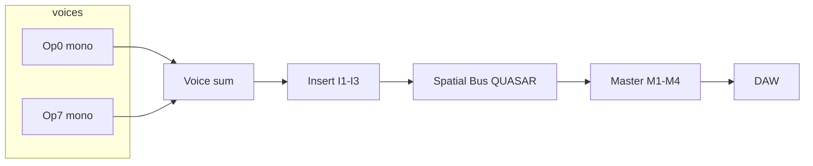

# FX Deep Pass Plan — Quasar identity, compression, reverb, delay sync

**Branch:** `cursor/favorites-unison-stack-daw`  
**Status:** Delay tempo sync **shipped v1.1.2**; compression/reverb/Quasar placement = plan  
**Related:** [`FX_BANK.md`](FX_BANK.md), [`GLOBAL_QUASAR_FX_PLAN.md`](GLOBAL_QUASAR_FX_PLAN.md), [`NEUZEIT_QUASAR_RESEARCH.md`](NEUZEIT_QUASAR_RESEARCH.md)

---

## Current FX chain audit

### Signal flow (today)

```
8 voices × unison (Layer A [+ Layer B stack])
  → layer insert FX  I1 → I2 → I3
  → stereo sum (+ masterGain)
  → master FX        M1 → M2 → M3 → M4
  → DAW
```

| Slot group | Count | Algorithms |
|------------|------:|------------|
| Layer inserts | 3 | All 10 types + Bypass |
| Master bus | 4 | All 10 types + Bypass (typical: Reverb / EQ / Comp / Quasar or Limiter) |

**Processors:** Saturation, Chorus, TapeDelay, NodeDelay, FreqShiftEcho, FractalEcho, Reverb (M7 FDN), EQ, Compressor, Limiter, **BinauralSpace (QUASAR)** — see [`EffectTypes.hpp`](../engine/include/pw8/effects/EffectTypes.hpp).

### Compressor (today)

- **Model:** Feedforward peak detector, stereo-linked, soft-knee gain computer, attack/release on GR envelope, optional post-GR output transformer colour (`OutputTransformerStage`), manual makeup gain
- **Not yet:** VCA/FET/opto character modes, feedback topology, GR meter tap, auto-makeup, dedicated mod-matrix destinations beyond generic master FX mix

### Reverb (today)

- **Single algorithm:** 8-line Jot/Householder FDN late tank + Schroeder/Dattorro input diffuser + discrete early reflections + **three-band** RT60 (M7-inspired HF/LF multipliers)
- **Not yet:** Plate/Hall/Room/Spring/Shimmer type switch; character presets as first-class product surface

### Quasar / BinauralSpace (today)

- **Placement:** One **master slot** only, **post-sum**
- **Input:** Stereo bus summed to mono for QSR paths (`(L+R)/2` after HPF split); CNTR keeps filtered L/R dry anchor
- **DSP:** Dual QSR (ITD/ILD binaural panner + embedded `RoomEngine` FDN per path) + CNTR + post-sum stereo delay
- **Gap vs Neuzeit Quasar:** Hardware Quasar places **discrete mono sources** into a shared 3D binaural scene **before** downstream mix; MURMUR applies one scene to the **already-summed** stereo bus

### Delay tempo sync (shipped v1.1.2)

| Param | APVTS suffix | Scope |
|-------|--------------|-------|
| Tape sync on/off | `TapeDelaySync` | Any slot |
| Tape division | `TapeDelaySyncDivision` | 0–8 → 1/1 … 1/8T |
| Quasar sync on/off | `QuasarDelaySync` | Quasar slot |
| Quasar division | `QuasarDelaySyncDivision` | same table |

Engine reads host BPM via `Engine::setTempo()` (Logic project tempo). FREE mode uses `TapeDelayMs` / `QuasarDelayTimeMs`.

---

## A. Quasar identity & chain placement

### Problem

Quasar is architecturally a **master-bus stereo widener/spatializer**, not a **per-source binaural router**. Users expect Neuzeit-like behaviour: each mono stem (kick, vocal, synth) gets its own azimuth/elevation/distance in a shared 3D headphone mix.

### Product definition (recommended)

| Product surface | What it IS | What it is NOT |
|-----------------|------------|----------------|
| **QUASAR (`BinauralSpace`)** | Scene spatial mixer: place the **mixed image** (or future per-source sends) in headphone-first 3D space with CNTR anchor + QSR1/QSR2 + short room + rhythmic delay wash | A replacement for algorithmic hall reverb |
| **Reverb slot (`Reverb`)** | Standalone **M7-class hall/plate-style** tail — size, multiband decay, diffusion, early/late mix | Per-object binaural panner |
| **Quasar embedded room** | Small **per-QSR ambience** (light FDN) for proximity — not a substitute for a dedicated Reverb slot on the master chain | Full hall reverb |

### Placement options

| # | Architecture | Pros | Cons |
|---|--------------|------|------|
| 1 | **Per-voice binaural send** before sum | True discrete mono → HRTF; matches hardware Quasar philosophy | Highest CPU; 8× unison × voices; needs send level per operator |
| 2 | **Per-operator tap** (8 mono taps) | Matches FM matrix mental model; moderate CPU | Requires patch schema + UI for 8 positions; still pre-sum |
| 3 | **Post-sum with per-op panner inputs** (current + mod) | Already shipped; SPACE macro + morph | Cannot place kick and pad on opposite azimuths independently |
| 4 | **Dedicated spatial bus** after voice mix, before master FX | Clean separation: `voice sum → SpatialBus (Quasar) → M1–M4`; one scene, optional multi-mono inputs later | Refactor insert/master ordering; migration for presets |

### Recommendation: **Option 4 → phased Option 2**

**Phase A (v1.2):** Promote Quasar to a **fixed spatial bus** slot (not swappable with Tape/Reverb in the same slot semantics):

```
voices → layer inserts → sum
  → [Spatial Bus: BinauralSpace]   ← always present when patch.metadata.masterFx == quasar
  → master M1–M4 (Reverb, EQ, Comp, Limiter)
```

**Phase B (v1.3+):** Add **8 operator mono sends** into QSR1/QSR2/CNTR assign matrix (Neuzeit-like “sources in a scene”), keeping one shared room/delay tail.



**ASCII (target state):**

```
     op0 ──┐
     op1 ──┤ mono taps (Phase B)
     …     │
     op7 ──┘
       ╲   ╱
        SUM (layer gain/pan)
          │
    [ I1 → I2 → I3 ]
          │
   ┌──────▼──────┐
   │ QUASAR BUS  │  QSR1 / QSR2 / CNTR / room / delay
   └──────┬──────┘
          │
   [ M1 → M2 → M3 → M4 ]
          │
        output
```

---

## B. Compression deep pass

### Audit summary

Current [`CompressorProcessor`](../engine/include/pw8/effects/Compressor.hpp) is a **single generic feedforward peak** comp with soft knee and transformer colour — solid baseline, not yet **character-distinct**.

### Proposed enhancements

| Feature | Notes |
|---------|-------|
| **Topology enum** | Feedforward (default) vs feedback (1176-style grab) |
| **Character enum** | VCA (clean), FET (fast, bright), Opto (slow, soft) — maps to attack/release curves + optional parallel mix |
| **GR meter tap** | Expose `gainReductionDb` to UI + optional `ModSource` sidechain-style read |
| **Knee** | Already present (`compKneeDb`); expose in PLAY for master COMP |
| **Auto-makeup** | Optional: estimate makeup from threshold/ratio |
| **Mod matrix** | `CompThreshold`, `CompRatio`, `CompAttack`, `CompRelease`, `CompMakeup`, `CompMix` per master slot index |

**Effort:** M (DSP) + S (UI facet rows) + S (mod destinations)

---

## C. Reverb choices

### Today

One M7 FDN implementation with rich param surface (size, multiband decay, diffusion, density, modulation, early/late, VLF cut).

### Proposal

| Approach | Description |
|----------|-------------|
| **A. Reverb `type` enum** | Plate / Hall / Room / Spring / Shimmer — each swaps FDN size tables, diffusion defaults, mod depth, optional shimmer feedback path |
| **B. Character presets** | Keep one engine; factory “Hall / Plate / …” map to param bundles (lower risk) |
| **Relationship to Quasar** | Quasar **room** stays small embedded FDN per QSR; **Reverb slot** remains the long hall; patches may use both (Quasar proximity + Reverb hall) |

**Recommend:** Start with **B** (preset bundles + metadata tag `reverbCharacter`) → evolve to **A** if CPU allows multiple tuned tanks.

---

## D. Delay tempo sync

### Shipped (v1.1.2)

- [`pw8/dsp/TempoSync.hpp`](../engine/include/pw8/dsp/TempoSync.hpp) — shared division table
- **Tape Delay** + **Quasar post-delay** sync to host BPM
- **UI:** FX tab SYNC/DIV rows (TAPE + QUASAR types); GLOBAL → QUASAR delay sync rows
- **Tests:** `EffectsTests` tempo cases for TapeDelay and BinauralSpace

### Follow-ups

| Item | Priority |
|------|----------|
| NodeDelay / FractalEcho / FreqShiftEcho sync | Medium |
| Sync-aware plugin latency reporting | Low |
| Mod matrix `DelayTime` offset respects sync base | Medium |

See also: [`MOD_VISUAL_FEEDBACK.md`](MOD_VISUAL_FEEDBACK.md) — live mod ghost pointers on GlowKnob (v1.1.2).

---

## Logic Pro verification (delay sync)

1. Install AU **v1.1.2** (`scripts/install_au_local.sh` or pkg).
2. Set Logic project to **120 BPM**.
3. Load a patch with **TAPE** on insert I1 (or master slot).
4. **Advanced → FX** → select slot → TYPE **TAPE** → **SYNC: TEMPO**, **DIV: 1/4**.
5. Hold a note — echo should land on the beat (~500 ms at 120 BPM).
6. Change project tempo to **90 BPM** — echo spacing should lengthen without reopening the plugin.
7. **GLOBAL → QUASAR** → enable **DLY SYNC / 1/8** on Quasar delay; confirm rhythmic tail follows tempo.
8. Toggle **FREE** — `Time` knob ms value should control delay again.

---

## Version roadmap (FX)

| Version | Focus |
|---------|-------|
| **1.1.2** ✅ | Delay tempo sync MVP |
| **1.2.0** | Quasar spatial bus refactor (Option 4 Phase A); COMP knee/GR meter in UI |
| **1.3.0** | Per-operator Quasar sends (Option 2); Reverb character bundles |
| **1.4.0** | Reverb type enum / Spring / Shimmer; COMP character modes |
