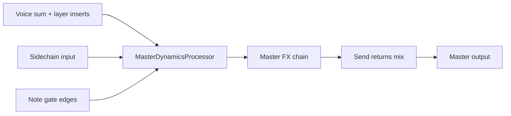

# Master Dynamics (Streams Track C)

**Date:** 2026-08-17  
**Status:** Sprint 4 scaffold  
**Related:** [MUTABLE_INSTRUMENTS_INTEGRATION_PLAN.md §7](MUTABLE_INSTRUMENTS_INTEGRATION_PLAN.md#7-track-c--streams-master-dynamics), [MI_IMPLEMENTATION_SPRINT.md](MI_IMPLEMENTATION_SPRINT.md)

MIT-clean-room conceptual parity with Mutable Instruments **Streams** — envelope, vactrol, follower, and compressor modes on the master bus. No vendored MI firmware; behavior is validated by unit tests and listening checks.

---

## 1. Render graph insert point



**Location:** `Engine::process()` — after voice sum, layer inserts, and master-gain mod; **before** `masterChain_.process()`.

Sidechain samples (`sidechainLeft` / `sidechainRight`) and note-gate rising edges feed the processor. When `masterDynamics.enabled == false`, the block is a no-op (backward compatible).

---

## 2. Four modes

| Mode | MI analog | Control source | Gain law |
|------|-----------|----------------|----------|
| **Envelope** | Streams envelope | Gate trigger → AD/AR | `gain = envelope` (0→1→0 swell) |
| **Vactrol** | Streams vactrol | Gate trigger → opto slew | `gain = optoState` (fast attack, slow release) |
| **Follower** | Streams follower | Sidechain RMS envelope | `gain = 1 − env × sidechainGain` (duck) |
| **Compressor** | Streams compressor | Program peak (+ optional SC) | Soft-knee GR + makeup |

### Envelope

- Rising gate edge (any voice `gateOn`) retriggers.
- Attack: `attackMs` exponential rise 0→1.
- Release: `releaseMs` exponential fall 1→0 (AR; no sustain hold).

### Vactrol

- Same trigger as envelope.
- Attack uses `attackMs`; release uses `vactrolSlewMs` (typically slower opto tail).
- Asymmetric one-pole smoothing mimics LED/LDR lag.

### Follower

- Per-sample sidechain mono RMS → `SidechainFollower`-style envelope.
- Depth scaled by `sidechainGain` (0..2 nominal).
- Falls back to program-material peak when sidechain bus is silent.

### Compressor

- Feedforward peak detector on stereo max(L,R).
- Soft knee around `thresholdDb`, ratio `ratio`, ballistics `attackMs` / `releaseMs`.
- `makeupDb` applied after GR.

---

## 3. Patch schema

Additive field on `Patch` (default = bypass):

```jsonc
"masterDynamics": {
  "enabled": false,
  "mode": "follower",
  "thresholdDb": -12.0,
  "ratio": 4.0,
  "attackMs": 5.0,
  "releaseMs": 80.0,
  "sidechainGain": 1.0,
  "vactrolSlewMs": 40.0,
  "makeupDb": 0.0,
  "mix": 1.0
}
```

| Field | Type | Default | Notes |
|-------|------|---------|-------|
| `enabled` | bool | `false` | Master bypass |
| `mode` | string | `"envelope"` | `envelope` \| `vactrol` \| `follower` \| `compressor` |
| `thresholdDb` | float | `-12` | Compressor threshold |
| `ratio` | float | `4` | Compressor ratio ≥ 1 |
| `attackMs` | float | `5` | Envelope / comp attack |
| `releaseMs` | float | `80` | Envelope / comp release |
| `sidechainGain` | float | `1` | Follower depth; mod via `SidechainDepth` |
| `vactrolSlewMs` | float | `40` | Vactrol release slew |
| `makeupDb` | float | `0` | Compressor makeup |
| `mix` | float | `1` | Wet mix 0..1; mod via `MasterDynamicsMix` |

Legacy patches omitting `masterDynamics` deserialize to `enabled: false`.

---

## 4. Mod matrix destinations

| Destination | Scope | Effect |
|-------------|-------|--------|
| `MasterDynamicsMix` | Global / Layer | Additive offset to `mix` (clamped 0..1) |
| `SidechainDepth` | Global / Layer | Additive offset to `sidechainGain` (clamped 0..2) |

Applied in `ModMatrixExecutor::applyMasterBus()` and consumed in `Engine::process()` when calling `MasterDynamicsProcessor`.

---

## 5. UI surfaces

| Surface | Figma | Component |
|---------|-------|-----------|
| PLAY OUTPUT | `89:1798` | `MasterOutputDeck` — mode pills, GR meter, sidechain viz |
| DESIGN lab | `89:2059` | `DesignDynamicsLabPanel` — transfer curves, signal diagram |

APVTS parameters mirror the patch fields (`masterDynamics*` ids in `PluginState.h`).

---

## 6. Tests

| Test | File | Asserts |
|------|------|---------|
| Serializer roundtrip | `PatchSerializerTests.cpp` | All fields survive JSON |
| Follower duck | `MasterDynamicsProcessorTests.cpp` | Sidechain envelope → GR > 0 |
| Envelope trigger | same | Gate edge → audible gain swell |

---

## 7. Milestones (integration plan §7.4)

| ID | Deliverable | Sprint |
|----|-------------|--------|
| C-M1 | Follower + envelope modes | Sprint 4 |
| C-M2 | Compressor + GR meter UI | Sprint 4 |
| C-M3 | Vactrol polish + factory presets | Future |
