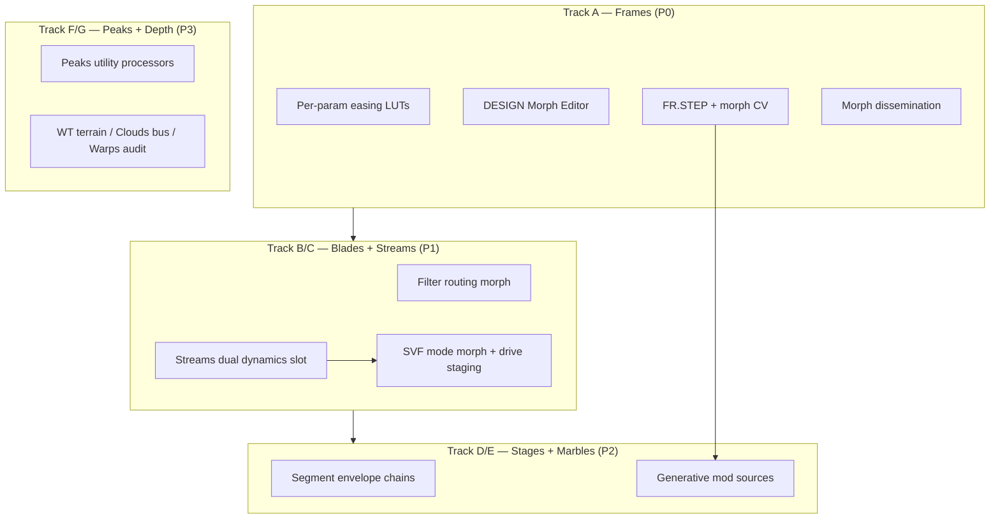

# Mutable Instruments Integration Plan

**Date:** 2026-08-17  
**Status:** **In progress** — Track A-M1 (MorphEasing) started  
**Audience:** Engine, UI, content, MCP  
**Related:** [`MUTABLE_INSTRUMENTS_FRAMES_RESEARCH.md`](MUTABLE_INSTRUMENTS_FRAMES_RESEARCH.md), [`MORPH_KOIN_SPEC.md`](MORPH_KOIN_SPEC.md), [`PRIOR_ART.md`](PRIOR_ART.md), [`HORIZON2.md`](HORIZON2.md), [`META_MOD_PLAN.md`](META_MOD_PLAN.md), [`MI_IMPLEMENTATION_SPRINT.md`](MI_IMPLEMENTATION_SPRINT.md) (C++ sprint checklist)

**Source repo:** [pichenettes/eurorack](https://github.com/pichenettes/eurorack) (Émilie Gillet / Mutable Instruments)

---

## 1. Executive summary

This plan brings **conceptual and algorithmic DNA** from MI’s most influential modules into MURMUR — not Eurorack panels, not circuit clones, not the “Mutable Instruments” trademark.

| Track | MI module | MURMUR surface | Priority |
|-------|-----------|----------------|----------|
| **A — Frames** | Keyframer / timeline morph | `morphKoin`, Morph KOIN, Motion Lab | **P0** — partial ship; close parity gap |
| **B — Blades** | Dual filter + drive + routing morph | Filter 1/2, DESIGN Filter Lab | **P1** |
| **C — Streams** | Dynamics gate (env / vactrol / follower / comp) | Master OUTPUT + sidechain | **P1** |
| **D — Stages** | Segment generator | Master Motion Lab, envelopes | **P2** |
| **E — Marbles** | Generative CV | Arp + mod matrix sources | **P2** |
| **F — Peaks** | Mini trigger → envelope / LFO utility | Layer utility mod | **P3** (no drum mode) |
| **G — Depth** | Plaits / **Clouds (master FX)** / Warps | WT terrain, master texture slot, vocoder audit | **Ongoing** |

**Program length (estimate):** 6–9 months calendar, 3 parallel workstreams (engine / UI / content), shipped incrementally behind feature flags.

---

## 2. Guardrails (non‑negotiable)

| Rule | Rationale |
|------|-----------|
| **MIT STM32 firmware only** for implementation reference | Plaits, Clouds, Warps, Frames, Stages, Marbles, Streams, Peaks, Tides — see repo README |
| **No GPLv3 AVR ports** (Grids, Edges, Branches) | Keeps closed-source shipping option open — [`PRIOR_ART.md`](PRIOR_ART.md) |
| **No analog circuit clones** (Blades, Ripples, Veils) | Original TPT SVF + `CharacterFilter`; steal **topology UX**, not SPICE |
| **No MI trademark** on features, presets, or marketing | “Keyframe morph”, “dual filter routing”, etc. |
| **No vendored MI code** | Reimplement from published algorithms + your own tests |
| **Preserve `.pw8` backward compatibility** | Additive schema fields; default = today’s behavior |

**Fix doc debt:** [`PRIOR_ART.md`](PRIOR_ART.md) incorrectly lists **Peaks** with GPL AVR modules — Peaks is **STM32 / MIT** and is in scope for Track F.

---

## 3. Current state vs target

### 3.1 Shipped today (baseline)

| Capability | Location | MI analog |
|------------|----------|-----------|
| Morph KOIN executor (2–4 keyframes, global curve) | `MorphKoinExecutor.hpp`, `morphPosition` APVTS | Frames (partial) |
| Macro KOINS + dissemination | `MacroSpread.hpp`, `Engine.cpp` | PoliMATHS / Hydrasynth (not MI) |
| Mod matrix + curve shaping (LIN/EXP/LOG/S) | `ModMatrixExecutor.hpp`, `ModCurveShaping.hpp` | Frames response curves (partial) |
| Filter 1 SVF + Filter 2 character (serial) | `Voice.hpp`, `StateVariableFilter.hpp` | Blades (partial — no routing morph) |
| Sidechain follower → mod | `SidechainFollower.hpp` | Streams follower (partial) |
| Vocoder FX | `Vocoder.hpp`, `VocoderLabPanel` | Warps vocoder (needs audit) |
| Granular operator | `GranularOscillator.hpp` | Clouds (operator-scope only) |
| Arpeggiator | `Arpeggiator.hpp` | Plaits arp / Marbles (deterministic only) |
| Master Motion Lab shell | `MasterMotionLabPanel` | Stages + Tides (UI only) |

### 3.2 Gap summary

```
Frames   ████████░░  80% metadata/DSP; missing per-param easing, FR.STEP, DESIGN editor, dissemination
Blades   ███░░░░░░░  30% two filters exist; missing mode morph, routing morph, per-filter drive
Streams  ██████░░░░  60% follower/envelope/vactrol/comp scaffold + masterDynamics schema (Track C Sprint 4)
Stages   █░░░░░░░░░  10% ADSR + LFO panels; no segment chains
Marbles  ░░░░░░░░░░   0% no generative mod sources
Peaks    ░░░░░░░░░░   0% no utility trigger processors
Plaits   ██████░░░░  60% WT engine; no terrain / chord engine
Clouds   ███░░░░░░░  30% granular osc; no bus texture processor
Warps    ████░░░░░░  40% vocoder exists; filter-bank quality unverified vs MI
```

---

## 4. Program architecture



**Dependency rationale:** Frames easing LUTs reuse in Blades mode morph and Stages segment shapes. Sidechain infra from Streams feeds Marbles-style performance modulation.

---

## 5. Track A — Frames (Keyframe morph parity)

**MI reference:** `frames/keyframer.{h,cc}`, `frames/resources/lookup_tables.py`  
**MURMUR anchor:** `morphKoin`, `MorphKoinExecutor.hpp`, `PatchFocusPanel`, Spatial factory presets

Frames is the **spine** of this program — other tracks extend the same “morph dimension” metaphor (filter routing morph, segment morph, generative morph CV).

### A.1 What Frames has that we don’t

| Frames feature | MURMUR today | Target |
|----------------|--------------|--------|
| Up to **64 keyframes** (MI) | 2–4 PLAY / **16 DESIGN cap** | **16 max** in `.pw8`; PLAY KOIN labels up to 4 |
| **Per-channel easing** (step, linear, in/out quartic, sine, bounce) | One global `morphKoin.curve` string | Per-override-path or per-keyframe-segment curve |
| **Per-channel response** (linear vs log gain law) | Mod matrix `ModCurve` on routes | Optional `response` on param override keys |
| **FRAME CV** autoplay | `morphPosition` APVTS only | Mod dest `MorphPosition` + LFO route |
| **FR.STEP** trigger at keyframe crossing | — | MIDI note / gate out / arp accent hook |
| **ADD/DEL** keyframe UX | Agent + JSON only | DESIGN Morph Editor |
| **RGB timeline feedback** | — | Morph scope strip (hue = position) |
| **Sequencer sub-mode** (step without interpolate) | `curve: "step"` global only | Per-segment step + `wrap` |
| **Dissemination at note-on** | Macros only | Optional `morphDissemination` per voice |

### A.2 Schema changes (additive, v3 → v3.1)

```jsonc
"morphKoin": {
  "label": "EVOLVE",
  "position": 0.35,
  "curve": "smooth",
  "wrap": false,
  "maxKeyframes": 16,
  "autoplaySource": "none",
  "keyframes": [
    {
      "name": "TIGHT",
      "position": 0.0,
      "color": "#4a90d9",
      "macroValues": [0.1, 0.0, ...],
      "paramOverrides": {
        "filterCutoffHz": { "value": 900, "easing": "inQuartic", "response": "linear" }
      }
    }
  ]
}
```

| Field | Notes |
|-------|-------|
| `keyframes[].color` | Optional UI hue (Frames RGB knob analog) |
| `paramOverrides` value | v3.1: allow `{ value, easing?, response? }` object OR bare float (backward compat) |
| `autoplaySource` | `none` \| `lfo1`..`lfo8` \| `modWheel` \| `sidechain` |
| `voiceSettings.morphDissemination` | bool — freeze `morphPosition` at note-on |

**Schema bump:** defer v4 until breaking change required; use optional object form in overrides.

### A.3 Engine work

| Task | File(s) | Notes |
|------|---------|-------|
| **Easing enum + LUTs** | New `MorphEasing.hpp` | Port MI curves: step, linear, in/out quartic, sine, bounce — same math as `ModCurveShaping.hpp` pattern |
| **Per-path easing in executor** | `MorphKoinExecutor.hpp` | Segment `localT` → `ease(localT, path.easing)` before lerp |
| **Response law on overrides** | `MorphKoinExecutor.hpp` | `applyResponse(value, response)` for log vs linear macro feel |
| **Mod dest `MorphPosition`** | `ModMatrixTypes.hpp`, executor, `Engine.cpp` | Offset/add to `morphKoin.position` with clamp/wrap |
| **FR.STEP detector** | `PatchworkEightProcessor.cpp` | Compare prev/current morph; fire `onMorphKeyframeCrossed(index)` for UI/MIDI |
| **Morph dissemination** | `Voice.hpp`, `Engine.cpp` | Store `voice.morphPosition` at note-on when flag set |
| **Expand param override paths** | `MorphKoinExecutor.hpp` | WT position, filter2 drive, master FX mix, Quasar fields (extend existing Quasar overrides) |

### A.4 UI work

| Surface | Component | Deliverable |
|---------|-----------|-------------|
| **PLAY** | `PatchFocusPanel` | Morph hub shows keyframe names at extremes; hue ring by position |
| **PLAY Advanced** | `PlayModeEditor` MOTION tab | Timeline strip: keyframe ticks, play-head, tap-to-snap |
| **DESIGN** | New `DesignMorphEditorPanel` | ADD/DEL keyframes, edit at play-head, per-path easing menu, color picker |
| **DESIGN** | `DesignModMatrixPanel` | Route to `MorphPosition`; show autoplay source chip |
| **Chrome** | `MurmurChromeBar` | “Keyframe crossed” flash (FR.STEP visual) |

### A.5 Content + MCP

| Task | Owner |
|------|-------|
| Migrate 75 Spatial presets → per-path `smooth` easing | Content script |
| 10 new **Frames-style** demo presets (4 keyframes, autoplay LFO) | Factory Interstellar/Morph |
| MCP `set_morph_koin` — easing per override, colors, autoplay | `mcp_server/` |
| MCP `add_morph_keyframe` / `remove_morph_keyframe` | Agent authoring |
| Mission card: `"EVOLVE: TIGHT → BLOOM → VOID"` with curve hints | Already partial |

### A.6 Tests

- `MorphEasingTests.cpp` — LUT parity vs MI reference values (sample 0, 0.25, 0.5, 0.75, 1)
- `MorphKoinExecutorTests.cpp` — per-path easing, wrap, dissemination freeze
- `PatchSerializerTests.cpp` — override object form roundtrip
- Golden: Spatial/001 morph sweep RMS delta

### A.7 Frames milestones

| Milestone | Exit criteria | Est. |
|-----------|---------------|------|
| **A-M1** | Easing enum + global curve uses LUTs (incl. bounce/quartic) | 1 wk |
| **A-M2** | Per-path easing in executor + serializer | 2 wk |
| **A-M3** | `MorphPosition` mod dest + autoplay | 1 wk |
| **A-M4** | DESIGN Morph Editor (CRUD keyframes) | 3 wk |
| **A-M5** | FR.STEP + morph dissemination | 2 wk |
| **A-M6** | PLAY timeline strip + factory refresh | 2 wk |

**Total Track A:** ~11 weeks

---

## 6. Track B — Blades (Dual filter performance)

**MI reference:** Hardware only (`blades/hardware_design/`) — no firmware; use [Blades manual](https://mutable-instruments.net/modules/blades/) for UX spec  
**MURMUR anchor:** `StateVariableFilter`, `CharacterFilter`, `Voice.hpp`, Advanced FILTER tab

### B.1 Target behavior

| Blades concept | Implementation sketch |
|----------------|----------------------|
| **LP ↔ BP ↔ HP morph** | Replace discrete `FilterMode` enum with `modeMorph` float 0..1 (LP→BP→HP blend on SVF outputs) |
| **Pre-filter drive** | `filter1.drive` + optional `filter2.drive` — soft clip → wavefold (reuse PhaseShape wavefolder) |
| **Routing morph** | New `filterRouting` 0..1: serial → parallel → crossfade |
| **F2 relative cutoff** | `filter2.cutoffOffsetSemitones` relative to F1 modulated cutoff |
| **Self-osc level match** | SVF resonance compensation (MI “constant amplitude”) — gain trim vs resonance |

### B.2 Schema (`layerA`)

```jsonc
"filter1": { "enabled": true, "modeMorph": 0.0, "drive": 0.0, ... },
"filter2": { "enabled": true, "drive": 0.2, "cutoffOffsetSemis": 7.0, ... },
"filterRouting": 0.0
```

### B.3 Engine

| Task | File(s) |
|------|---------|
| `modeMorph` on SVF | `StateVariableFilter.hpp` — blend LP/BP/HP outputs |
| Dual drive staging | `Voice.hpp` — drive before each filter |
| Routing matrix | `Voice.hpp` — `y = lerp(f1(f2(x)), f2(f1(x)), blend(f1(x), f2(x)), routing)` |
| Mod destinations | `FilterRouting`, `FilterModeMorph`, `FilterDrive` |
| Live params | `Engine::setFilterRoutingLive()` |

### B.4 UI

| Surface | Deliverable |
|---------|-------------|
| **FILTER tab** | “BLADES” sub-panel: routing morph knob, mode morph, dual drive |
| **DESIGN** | Filter Lab wireframe — routing diagram animates with knob |
| **Mod matrix** | Destinations for routing + mode morph |

### B.5 Milestones

| Milestone | Exit | Est. |
|-----------|------|------|
| **B-M1** | `modeMorph` DSP + tests | 2 wk |
| **B-M2** | Routing morph in `Voice.hpp` | 3 wk |
| **B-M3** | UI + mod routes + 15 factory patches tagged `Filter2+Blades` | 2 wk |

**Total Track B:** ~7 weeks (overlaps A-M4)

---

## 7. Track C — Streams (Master dynamics)

**MI reference:** `streams/compressor.{h,cc}`, `streams/envelope.{h,cc}`, `streams/follower.{h,cc}`  
**MURMUR anchor:** Master OUTPUT deck, `SidechainFollower.hpp`, master FX chain

### C.1 Four modes (Streams parity)

| Mode | Behavior | MURMUR mapping |
|------|----------|----------------|
| **Envelope** | Trigger → AD/AR on gain + optional filter | Master bus gain + filter cutoff duck |
| **Vactrol** | Opto model with adjustable slew | Pluck / swell on master or layer |
| **Follower** | Track sidechain envelope → apply to bus | Extend `SidechainFollower` → master gain |
| **Compressor** | Soft knee, sidechain, makeup | New `MasterDynamics.hpp` |

### C.2 Schema

```jsonc
"masterDynamics": {
  "enabled": true,
  "mode": "compressor",
  "thresholdDb": -12,
  "ratio": 4.0,
  "attackMs": 5,
  "releaseMs": 80,
  "sidechainGain": 1.0,
  "vactrolSlewMs": 40
}
```

### C.3 Engine + UI

| Task | Notes |
|------|-------|
| `MasterDynamicsProcessor` | MIT-clean-room from Streams spec, not copy-paste |
| Insert in `Engine.cpp` post-voice sum, pre-master FX | |
| Sidechain already routed — reuse buffer | |
| OUTPUT tab: mode selector + gain reduction meter | |
| Mod: `MasterDynamicsMix`, sidechain depth | |

### C.4 Milestones

| Milestone | Exit | Est. |
|-----------|------|------|
| **C-M1** | Follower + envelope modes | 2 wk |
| **C-M2** | Compressor + GR meter | 2 wk |
| **C-M3** | Vactrol + factory “Streams” presets | 1 wk |

**Total Track C:** ~5 weeks

---

## 8. Track D — Stages (Segment modulation)

**MI reference:** `stages/segment_generator.{h,cc}`, `stages/chain_state.{h,cc}`  
**MURMUR anchor:** `MasterMotionLabPanel`, `MasterEnvelopePanel`, `DahdsrEnvelope`

### D.1 Target

Replace single ADSR per envelope slot with **chain of up to 6 segments** per env:

| Segment type | MI analog | Use |
|--------------|-----------|-----|
| **Ramp** | Rise/fall | Standard envelope legs |
| **Hold** | Step | Sustain plateaus |
| **Step** | Instant jump | Sequencer-style |
| **Loop** | Repeat sub-chain | LFO-like cycles |

### D.2 Schema

```jsonc
"envelopes": [
  {
    "segments": [
      { "type": "ramp", "durationMs": 120, "level": 1.0, "shape": "inQuartic" },
      { "type": "hold", "durationMs": 400, "level": 1.0 },
      { "type": "ramp", "durationMs": 800, "level": 0.0, "shape": "outSine" }
    ],
    "loopStart": 0,
    "loopEnd": 2
  }
]
```

### D.3 UI

- Master Motion Lab: envelope column → **segment strip** editor (Stages-style dots)
- Reuse `MorphEasing.hpp` for segment shapes (shared with Track A)

### D.4 Milestones

| Milestone | Exit | Est. |
|-----------|------|------|
| **D-M1** | Segment generator DSP + unit tests | 3 wk |
| **D-M2** | Motion Lab segment UI | 3 wk |
| **D-M3** | Mod matrix env sources unchanged; 10 motion presets | 1 wk |

**Total Track D:** ~7 weeks

---

## 9. Track E — Marbles (Generative performance)

**MI reference:** `marbles/random/*`, `marbles/ramp/ramp_extractor.{h,cc}`, `marbles/scale_recorder.h`  
**MURMUR anchor:** Arpeggiator, mod matrix, `DeterministicRng`

### E.1 Target features

| Feature | MURMUR surface |
|---------|----------------|
| **Random stream** with spread / bias | New mod sources `Random1`..`Random4` |
| **Quantized random** (scale-aware) | Arp step probability + pitch offset from scale |
| **Deja Vu** (repeatable random) | Patch seed `generativeSeed` |
| **Lag processor** | Smooth random → mod dest |
| **Bernoulli** | Arp accent / ratchet coin flip |

### E.2 Schema

```jsonc
"generative": {
  "seed": 12345,
  "streams": [
    { "spread": 0.5, "bias": 0.0, "lagMs": 80, "quantScale": "minor" }
  ]
}
```

### E.3 Milestones

| Milestone | Exit | Est. |
|-----------|------|------|
| **E-M1** | Random mod sources + seed | 2 wk |
| **E-M2** | Arp probability ↔ Marbles spread | 2 wk |
| **E-M3** | DESIGN “Generative” chip + 10 presets | 1 wk |

**Total Track E:** ~5 weeks

---

## 10. Track F — Peaks (Utility processors)

**MI reference:** `peaks/processors.cc`, `peaks/modulations/*`  
**MURMUR anchor:** Layer insert FX, low-footprint mod

### F.1 Target

Dual **utility mod processors** on layer (not master) — **envelope and LFO only** (product decision: **no drum mode**).

| Mode | Use |
|------|-----|
| **Mini envelope** | Per-layer duck / swell |
| **Mini LFO** | Slow drift on one param |

Low priority utility track.

### F.2 Milestones

| Milestone | Exit | Est. |
|-----------|------|------|
| **F-M1** | Mini env/LFO as mod-only processors | 2 wk |

**Total Track F:** ~2 weeks (optional)

---

## 11. Track G — Depth (Plaits / Clouds / Warps)

Ongoing quality tracks — not blocking A–F.

| Module | Work | File targets |
|--------|------|--------------|
| **Plaits** | Wave terrain (8×8×3) for WT engine | `WavetableEngine`, `Design Wavetable Lab` |
| **Clouds** | **Master FX only** — `EffectType::Clouds` on `masterEffects[0..3]` | New `CloudsTexture.hpp`, `EffectChain.hpp`, DESIGN FX hero, `PatchSerializer` ordinal **13** |
| **Warps** | Vocoder filter-bank audit vs MI band count / envelopes | `Vocoder.hpp`, golden FFT tests |
| **Tides** | Unify LFO + envelope rate ranges | [`PRIOR_ART.md`](PRIOR_ART.md) Phase 5 |
| **Rings/Elements** | Resonator engine completion | `ResonatorOscillator.hpp`, Phase 10 |

### G.1 Clouds master FX (locked scope)

**Product decision:** Clouds is a **master-bus texture processor**, not an extension of operator granular.

| Property | Value |
|----------|-------|
| **Slot** | `Patch::masterEffects[0..3]` only (not layer insert in v1) |
| **Type enum** | `EffectType::Clouds` (ordinal 13 after Vocoder) |
| **Modes** | Granular texture, looping delay, pitch-shift (MI Clouds parity targets) |
| **Params** | `cloudsDensity`, `cloudsGrainSizeMs`, `cloudsPitch`, `cloudsFreeze`, `cloudsMode`, `mix` |
| **Buffer** | Fixed-capacity circular buffer on master bus (no RT alloc) |
| **Reference** | `clouds/dsp/granular_processor.{h,cc}` (MIT, clean-room port) |

Operator `GranularOscillator` remains a separate synthesis engine — do not conflate.

---

## 12. Cross-cutting work

### 12.1 MCP / agent tools (cumulative)

| Tool | Track |
|------|-------|
| `set_morph_koin` (extend) | A |
| `add_morph_keyframe`, `remove_morph_keyframe` | A |
| `set_filter_routing`, `set_filter_mode_morph` | B |
| `set_master_dynamics` | C |
| `set_envelope_segments` | D |
| `set_generative_stream` | E |

### 12.2 Meta-mod (Hydrasynth-style)

Implement [`META_MOD_PLAN.md`](META_MOD_PLAN.md) **after Track A-M2** so macro → morph depth and macro → mod depth compose cleanly.

### 12.3 Factory preset program

| Pack | Count | Theme |
|------|-------|-------|
| **Morph** (extend Spatial) | +25 | Frames autoplay + 4 keyframes |
| **Blades** | 15 | Filter routing sweeps |
| **Streams** | 10 | Sidechain pump / vactrol pluck |
| **Motion** | 10 | Stages segment envelopes |
| **Generative** | 10 | Marbles random mod |

### 12.4 Documentation updates

| Doc | When |
|-----|------|
| [`PRIOR_ART.md`](PRIOR_ART.md) | Sprint 0 — fix Peaks license; add Blades/Streams/Stages |
| [`MORPH_KOIN_SPEC.md`](MORPH_KOIN_SPEC.md) | A-M2 — per-path easing |
| [`MUTABLE_INSTRUMENTS_FRAMES_RESEARCH.md`](MUTABLE_INSTRUMENTS_FRAMES_RESEARCH.md) | A-M6 — mark shipped vs open |
| New [`docs/FILTER_ROUTING_SPEC.md`](FILTER_ROUTING_SPEC.md) | B-M1 — **shipped** Sprint 1 |
| New `docs/MASTER_DYNAMICS_SPEC.md` | C-M1 |

---

## 13. Recommended execution order

```
Sprint 0   (1 wk)   Guardrails doc fix, MorphEasing.hpp scaffold, feature flags
Quarter 1  (10 wk)  Track A complete (Frames parity)
Quarter 1  (7 wk)   Track B parallel from wk 4 (Blades)
Quarter 2  (5 wk)   Track C (Streams)
Quarter 2  (7 wk)   Track D (Stages) — starts after A-M2 (shared easing)
Quarter 3  (5 wk)   Track E (Marbles)
Quarter 3  (2 wk)   Track F optional (Peaks)
Ongoing            Track G depth + meta-mod
```

### Team split (suggested)

| Stream | Owns |
|--------|------|
| **Engine** | A executor, B Voice routing, C dynamics, D segments, E RNG |
| **UI** | Morph Editor, Filter Lab, OUTPUT dynamics, Motion segment strip |
| **Content/MCP** | Presets, agent tools, migration scripts |

---

## 14. Success metrics

| Metric | Target |
|--------|--------|
| Spatial morph presets with per-path easing | 100% of 75 |
| FR.STEP fires on keyframe cross (DAW automation) | Verified in Logic |
| Filter routing morph audible in A/B | 15 factory patches |
| Sidechain compressor GR meter | −12 dBFS test signal |
| Stages 3-segment envelope on Env1 | Motion Lab edit + hear |
| Marbles random mod → filter cutoff | 1 generative demo preset |
| No GPL contamination | `scripts/release_gate.sh` + license scan |
| Pluginval + unit tests green | CI gate |

---

## 15. Verify checklist (Logic Pro)

### Frames (Track A)

1. Load Spatial/001 — sweep **EVOLVE** morph; hear INTIMATE ↔ VOID with **bounce** easing on filter path.
2. DESIGN → Morph Editor — ADD keyframe at 0.5, edit macro snapshot, DEL keyframe.
3. Route LFO1 → Morph Position — autoplay evolution on held chord.
4. Enable morph dissemination — chord freezes morph point; live morph knob does not retune held voices.

### Blades (Track B)

5. FILTER → routing morph: serial ↔ parallel; self-osc stable across sweep.
6. Mode morph LP → BP → HP at fixed cutoff.

### Streams (Track C)

7. OUTPUT → Compressor mode; sidechain from bus; GR meter moves.
8. Vactrol mode — pluck master bus on arp gate.

### Stages (Track D)

9. Motion Lab → Env1 three segments; loop segment 1–2 as LFO.

### Marbles (Track E)

10. Random mod source → pan; same seed → same sequence after reload.

---

## 16. Product decisions — **LOCKED** (2026-08-17)

| # | Decision | Resolution |
|---|----------|------------|
| 1 | Max keyframes in DESIGN | **16** — stored in `.pw8`, enforced via `core::kMaxMorphKeyframes` |
| 2 | PLAY morph KOIN display | Up to **4** named keyframe labels on performance surface (`kMaxPlayMorphKeyframes`) |
| 3 | Clouds placement | **Master FX type** — `EffectType::Clouds` on `masterEffects[0..3]` only |
| 4 | Peaks / utility scope | **Mini envelope + LFO only** — **no drum mode** |
| 5 | Morph vs macro on same param | *Deferred* — default additive (macro delta on morphed baseline) until conflict reported |
| 6 | Filter routing schema bump | v3.1 additive (`filterRouting` field) — see Track B |

---

## 17. Open decisions (remaining)

| # | Question | Options |
|---|----------|---------|
| 1 | Clouds v1 mode set | Granular-only MVP vs granular + delay + pitch (full MI) |
| 2 | Morph dissemination default | Off vs on for Spatial factory pack |

---

## 18. Summary

**Frames is Track A / P0** — you already ship the spine (`morphKoin`, executor, Spatial presets). Closing the gap means **MI easing LUTs**, **per-path curves**, **DESIGN timeline editor**, **FR.STEP**, and **morph dissemination** — not reinventing morph from scratch.

**Blades + Streams** are the next highest ROI: dual-filter performance and master dynamics directly upgrade every factory preset that tags `Filter2`.

**Stages + Marbles** turn Motion Lab and the arp from “solid” into “modular-grade performance.”

**Peaks + Plaits/Clouds/Warps depth** fill out the long tail.

All tracks share one rule: **learn from MIT firmware and public manuals, implement original MURMUR code, preserve preset compatibility, and never ship Mutable’s trademark or GPL AVR code.**
