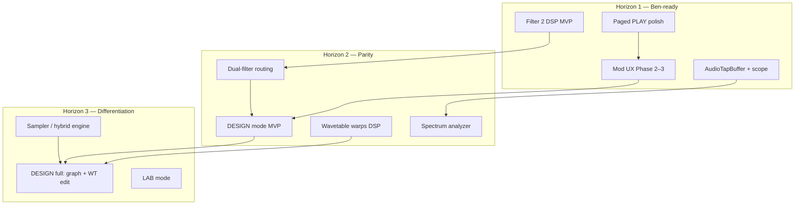

# MURMUR (Patchwork Eight) — Product Gap Implementation Plan

> **Note:** The accelerated implementation plan for **Gap 1 (DESIGN mode)** and **Gap 3 (wavetable warps)** is in [`DESIGN_AND_WARPS_PLAN.md`](DESIGN_AND_WARPS_PLAN.md).

**Status:** PLAN (Aug 2026)  
**Scope:** Six product gaps blocking competitive parity and sound-design workflow  
**Repo:** `/Users/cbackstr/repos/patchwork-eight`  
**Audience:** Ben / product + engineering sequencing

Grounded in the current codebase and existing docs (`ROADMAP.md`, `NEXT_STEPS.md`, `UI.md`, `UI_PAGED_LAYOUT.md`, `MOD_MATRIX_PLAN.md`, `MODULATION.md`, `DSP_ENGINE.md`, `COMPETITIVE_ANALYSIS.md`, `VISUALIZATION_UI_GATE5.md`, `PLUGIN_ARCHITECTURE.md`).

---

## Executive summary

Patchwork Eight’s **DSP foundation is strong** (8 engines, typed algorithm graph, 29-source mod matrix, Filter 1, FX bank, PLAY-mode OBSIDIAN UI). The six gaps below are mostly **authoring UX**, **timbre breadth**, and **competitive sound-source coverage** — not missing core realtime infrastructure.

**Recommended north star:** Ship **PLAY-mode depth + Filter 2 + analyzers + expanded mod UX** in Horizon 1 (Ben-ready), then **DESIGN mode MVP + wavetable warps + dual-filter routing** in Horizon 2, then **sampler/hybrid engine + full DESIGN** in Horizon 3.

---

## Cross-gap dependency graph

**Critical path for “feels shippable”:** PLAY polish → mod depth editing → Filter 2 → analyzers → DESIGN MVP.

**Parallelizable:** Wavetable warps (engine-only) can run alongside Filter 2; sampler is largely independent but touches schema, content pipeline, and a new engine type.

---

## Three horizons

| Horizon | Timeline | Goal | Primary gaps addressed |
|---|---|---|---|
| **H1 — Ben-ready** | 4–8 weeks | Performance + routing UX that matches engine capability; audible timbre upgrade | Gap 6 (mod UX), Gap 2 (Filter 2 MVP), Gap 5 (scope MVP), Gap 1 (PLAY-only slices) |
| **H2 — Competitive parity** | 3–6 months | Sound-design without hand-editing `.pw8`; Serum/Zebra-class filter/wavetable story | Gap 1 (DESIGN MVP), Gap 2 (dual filter), Gap 3 (warps), Gap 5 (spectrum), Gap 6 (full PLAY matrix) |
| **H3 — Differentiation** | 6–12+ months | Omnisphere/Kontakt-class hybrid + full authoring | Gap 4 (sampler/hybrid), Gap 1 (DESIGN full + LAB), advanced warps, content tooling |

---

## Quick wins (no full DESIGN mode)

These deliver user-visible value using existing schema/DSP:

1. **Mod amount sliders + ring depth** — engine already stores `ModRoute::amount`; wire UI per `MOD_MATRIX_PLAN.md` Phase 2 (`ModRoutingUi.cpp`, `ModSourceStrip.cpp`, `GlowKnob.cpp`).
2. **Expand PLAY destinations** — add Operator Level, WT Pos, Pan to `GlowKnob::enableModulationTarget` and FILTER/OSC pages (`FilterLfoPanel`, `OperatorEditorPanel`).
3. **Expand source palette** — add LFO 2–4, Env 2, remaining macros to `ModSourcePalette.cpp` (pattern already exists for 8 chips).
4. **Embed matrix on MOD tab** — `ModLauncherPanel` already hosts `ModSourceStrip`; remove “launcher-only” feel (`MOD_MATRIX_PLAN.md` Phase 3).
5. **Oscilloscope MVP** — `AudioTapBuffer` + time-domain paint only (`VISUALIZATION_UI_GATE5.md`); no OpenGL required for v1.
6. **Filter 2 preset character** — one nonlinear topology (e.g. soft ladder) before full mode matrix.
7. **Formant content story** — factory tables already exist (`content/wavetables/formant-vowel-*.json`); document + preset showcase while DSP warps land.
8. **Granular-as-sampler positioning** — Granular engine already plays long buffers from `wavetableId`; improve UX copy + preset templates (not a new engine).

---

# Gap 1 — No DESIGN mode

## Current state

| Area | What exists |
|---|---|
| **PLAY mode** | **IMPLEMENTED** — `plugin/src/ui/PlayModeEditor.{h,cpp}` with Basic/Advanced/Compact views, tabbed OSC/FILTER/ENV/MOD/FX pages, `NodeSelectorRow`, `PatchFocusPanel` (`uiFocus`), preset browser overlay |
| **Graph display** | Read-only `AlgorithmGraphView` (legacy circular view) + compact `NodeSelectorRow`; topology editing explicitly out of PLAY scope (`docs/UI.md`) |
| **Graph data** | `algorithm::AlgorithmGraphDefinition` in patch schema (`engine/include/pw8/algorithm/AlgorithmTypes.hpp`); compiled by `AlgorithmGraphCompiler` |
| **CLI editing** | `pw8-graph inspect` (`tools/graph_inspector/main.cpp`) — read-only |
| **Wavetable UI** | **Preview + assign only** — `WavetableStackView` (3D wireframe), Load/browse in `OperatorEditorPanel`; no sample editing |
| **Mod matrix UI** | Partial PLAY routing via `ModRoutingOverlay`, `ModSourceStrip`, `ModAssignmentController`; full matrix not editable (`docs/MOD_MATRIX_PLAN.md`) |
| **Mode switch** | DESIGN/LAB **PLANNED** — `plugin/src/ui/README.md`, `docs/PLUGIN_ARCHITECTURE.md` |

## Target UX

A distinct **DESIGN mode** (mode toggle in plugin chrome, not a PLAY tab) where a sound designer can:

- Add/remove/retype **algorithm edges** and mark output nodes without editing JSON
- **Draw/edit wavetable frames** (or import WAV → builder pipeline) and assign to operators
- Author **full mod matrix**: all 29 sources × all destinations, amount, scope, multi-route summing
- Edit **per-algorithm FX parameters** beyond `mix` (Reverb 15 fields, etc.)
- See **validation errors** inline (compiler status from `AlgorithmGraphCompiler`)

PLAY mode stays performance-first; DESIGN owns structural edits currently excluded from APVTS automation (`docs/PLUGIN_ARCHITECTURE.md`).

## Phased delivery

| Phase | Slice | Complexity | Notes |
|---|---|---|---|
| **MVP** | Mode shell + graph edge editor (add/remove edge, pick type, amount) + `loadPatch()` on commit | **L** | Reuse `AlgorithmGraphDefinition` validation; no node dragging required v1 |
| **MVP+** | Full mod matrix grid/overlay in DESIGN (all sources/destinations, amount, scope) | **M** | Engine ready; mirror `Engine::setModRoutesLive()` batch publish |
| **MVP+** | FX detail panels per slot (reuse `FxChainStrip` param spec tables from `PluginState.h`) | **M** | Mostly UI wiring |
| **Full** | Wavetable frame editor + `pw8-wavetable-builder` integration | **XL** | New editor surface; consider embedded mini-builder vs. external tool handoff |
| **Full** | Visual graph layout (non-circular), edge legend, compile preview | **L** | Extend or replace `AlgorithmGraphView` |
| **Full** | LAB mode (analysis, A/B render, MCP hooks) | **XL** | Separate mode; defer |

## Key files / modules

| Layer | Paths |
|---|---|
| UI shell | New `DesignModeEditor.{h,cpp}`, mode switch in `PatchworkEightProcessor::createEditor()` |
| Graph edit | `AlgorithmGraphView` or new `AlgorithmGraphEditor`, `algorithm/AlgorithmGraphCompiler.hpp`, patch serializer |
| Mod edit | `ModRoutingOverlay.*`, `ModRoutingUi.*`, `ModMatrixTypes.hpp`, `Engine::setModRoutesLive()` |
| Wavetable edit | `WavetableStackView.*`, `tools/wavetable_builder/main.cpp`, `WavetableTableLoader.hpp` |
| Processor | `PatchworkEightProcessor.cpp` — structural patch commits, double-buffer engine swap |
| Docs | `docs/UI.md`, `docs/UI_PAGED_LAYOUT.md` (don’t conflate paged PLAY with DESIGN) |

## Dependencies

- **Blocked by:** None for graph/mod MVP (schema + compiler exist)
- **Blocks:** Gap 3 full warp UI (knobs in DESIGN), Gap 4 sample mapping UI, honest “patch-only route” removal in Gap 6
- **Soft dependency:** Paged PLAY shell (`PlayModeEditor`) proves tab/navigation patterns DESIGN can reuse

## Risks — what NOT to build yet

- **Do not** build a draggable Eurorack cable UI — master spec forbids patch-cable spaghetti; use assign/list/wireless paradigms (`docs/COMPETITIVE_ANALYSIS.md`)
- **Do not** duplicate all 762 APVTS params as custom widgets in v1 — DESIGN can use generated panels from `ParamFieldSpec` tables first
- **Do not** ship wavetable spectral editor before warp DSP exists (Gap 3) — preview-only is fine
- **Do not** merge DESIGN into PLAY tabs — keeps performance UX clean (`UI_PAGED_LAYOUT.md`)

## Success criteria / acceptance tests

1. User creates FM bell patch entirely in-plugin (2 nodes, PM edge) without touching `.pw8` JSON
2. Invalid graph (cycle) shows compiler error; patch not applied to audio engine
3. Save/reload round-trip preserves edited graph via normal host state (`getStateInformation`)
4. Mod matrix: create 3 routes to same destination with different amounts; audible summing matches `ModMatrixExecutor` unit tests
5. `pluginval` strictness 5 still passes after DESIGN editor attach/detach
6. Manual: REAPER/Logic session — switch PLAY ↔ DESIGN without audio glitch

---

# Gap 2 — Filter / timbre breadth (Filter 2, dual filter)

## Current state

| Area | What exists |
|---|---|
| **Filter 1** | **IMPLEMENTED** — `filter::StateVariableFilter` (`engine/include/pw8/filter/StateVariableFilter.hpp`): LP/HP/BP/notch/peak, global + per-operator (`OperatorPatch::filter1`, `LayerPatch::filter1`) |
| **Signal path** | Per-op filter → graph mix → global Filter 1 → amp env (`docs/DSP_ENGINE.md`) |
| **Mod matrix** | `FilterCutoff/Resonance`, `OperatorFilterCutoff/OperatorFilterResonance` — **IMPLEMENTED** |
| **Filter 2** | **PLANNED** — comment stub in `Patch.hpp` line 170–171; `engine/include/pw8/filter/README.md` |
| **PLAY UI** | `FilterLfoPanel` — global or per-engine Filter 1 only; Filter 2 explicitly DESIGN territory (`docs/UI.md`) |
| **Competitive gap** | Zebra 13×12 filter matrix vs. one SVF topology (`docs/COMPETITIVE_ANALYSIS.md`) |

## Target UX

- **Filter 2** adds **character** (nonlinear drive, ladder/OTA/diode flavors) — audible weight and bite Filter 1 cannot provide
- **Dual-filter story:** serial or parallel routing of Filter 1 (clean) + Filter 2 (character), per global path and optionally per-operator
- PLAY: mode selector + drive/cutoff macros; DESIGN: full topology/mode matrix
- Mod matrix routes to Filter 2 cutoff/drive (new destinations or shared semantic)

## Phased delivery

| Phase | Slice | Complexity | Notes |
|---|---|---|---|
| **MVP** | Single Filter 2 topology (e.g. 4-pole soft ladder + tanh drive), global slot only | **M** | Clone Filter 1 integration pattern in `Voice::renderSample()` |
| **MVP+** | 2–3 character modes (ladder / OTA / diode — original math, not copied circuits per `PRIOR_ART.md`) | **L** | Shared nonlinear primitive + mode switch |
| **Full** | Dual-filter routing enum (serial/parallel, Filter1→Filter2 order) global + per-op | **L** | Schema addition in `LayerPatch` / `FilterParams` |
| **Full** | Filter 2 in PLAY (`FilterLfoPanel` or dedicated FILTER page section) + DESIGN detail | **M** | APVTS fields via `PluginState.h` |
| **Full** | Mod destinations `Filter2Cutoff`, `Filter2Drive` | **S** | Extend `ModMatrixTypes.hpp` + executor |

## Key files / modules

| Layer | Paths |
|---|---|
| DSP | New `engine/include/pw8/filter/CharacterFilter.hpp` (or per-topology files) |
| Voice chain | `engine/include/pw8/voice/Voice.hpp`, `Voice.cpp` render path |
| Schema | `engine/include/pw8/patch/Patch.hpp`, `filter::FilterParams` |
| Mod | `ModMatrixTypes.hpp`, `ModMatrixExecutor.hpp` |
| Plugin | `PluginState.h/.cpp`, `FilterLfoPanel.*`, `FilterWireframeView.*` |
| Tests | `tests/dsp/StateVariableFilterTests.cpp` (pattern), new character filter tests + render regression |

## Dependencies

- **Enables:** Dark bass / metallic presets without saturation-only workaround (`gate4-massive-dark-metallic-bass.pw8` uses insert saturation today)
- **Blocked by:** None — Filter 1 proved integration
- **Related:** Gap 6 (mod to Filter 2), Gap 1 (DESIGN filter editing)

## Risks — what NOT to build yet

- **Do not** clone Serum/Zebra filter coefficients — original TPT/nonlinear designs only
- **Do not** expose 13×12 mode matrix in v1 — 3 character modes + SVF is enough for parity story
- **Do not** add per-operator Filter 2 until global path is stable (CPU + UI complexity)
- **Do not** automate Filter 2 before DSP wired (honesty principle from `NEXT_STEPS.md`)

## Success criteria / acceptance tests

1. A/B render: Filter 2 on vs off measurably increases harmonic energy above 2 kHz at same RMS
2. Serial dual-filter: LP (Filter 1) → driven ladder (Filter 2) stable at max resonance — no NaN/Inf in 10 s hold (`pw8-fuzz-render` extended)
3. Mod route to Filter 2 cutoff changes timbre on held note (`EngineLiveParamsTests` pattern)
4. Preset: “character bass” using Filter 2 only (no insert saturation) passes ear check + peak < 1.0
5. `pluginval` automation suite passes new parameters

---

# Gap 3 — Wavetable warp depth (bend / sync / formant)

## Current state

| Area | What exists |
|---|---|
| **Wavetable oscillator** | Frame + sample interpolation, mip selection (`WavetableOscillator.hpp`, `WavetableTable.hpp`) — **no warp stage** |
| **Schema** | `wavetableFramePosition`, `wavetableId` only — **no warp fields** in `OperatorPatch` |
| **Related engine** | PhaseShape has bend/fold/asymmetry/shape (`PhaseShapeOscillator.hpp`) — different engine, similar UX metaphor |
| **Graph-level** | SYNC, PM/FM, RM edges between nodes — not per-table warp |
| **Content** | Formant tables pre-built (`content/wavetables/formant-vowel-*.json`) — static frames, not runtime formant warp |
| **UI** | `WavetableStackView` visualizes frames; WT POS knob in `OperatorEditorPanel` |
| **Docs** | Master spec taxonomy cited in `COMPETITIVE_ANALYSIS.md` (bend, mirror, fold, sync-style, phase distortion, asymmetry, spectral tilt) — **not implemented on wavetable path** |

Note: `WavetableOscillator.hpp` header still says “PARTIAL/no mip-mapping” but mip-mapping **is implemented** via `WavetableTable::viewForFrequency()` — doc drift only.

## Target UX

Serum-class **wt warp panel** on wavetable operators:

- **Bend** — phase curvature within cycle
- **Sync** — hard/soft sync read phase to master ratio
- **Formant** — spectral envelope shift / vowel morph (can complement static formant tables)
- Additional v2: mirror, fold, spectral tilt (per master spec taxonomy)

Warps apply **after mip selection, before sample read** (or on phase prior to read) with anti-aliasing awareness (2× OS on nonlinear warps, reuse `QualityMode` pattern).

## Phased delivery

| Phase | Slice | Complexity | Notes |
|---|---|---|---|
| **MVP** | `wtBend` + `wtAsymmetry` scalar warp on read phase | **M** | Schema v3 fields on `OperatorPatch` |
| **MVP+** | `wtSyncRatio` + sync amount (soft/hard blend) | **L** | May interact with graph SYNC edges — document precedence |
| **MVP+** | Formant shift (biquad bank or spectral envelope on table) | **L** | Leverage `dsp::Biquad`; test with existing formant content |
| **Full** | Full warp mode enum + combinable stack | **XL** | Mirror, fold, spectral tilt; mip-aware |
| **Full** | DESIGN wavetable editor with live warp preview | **XL** | Depends Gap 1 |
| **Full** | Mod destinations `OperatorWavetableBend`, etc. | **M** | Extend mod matrix |

## Key files / modules

| Layer | Paths |
|---|---|
| DSP | `WavetableOscillator.hpp` — warp stage; possibly `WavetableWarp.hpp` |
| Operator | `OperatorNode.hpp` — pass warp params |
| Schema | `OperatorPatch`, `PatchSerializer` migration v2→v3 |
| Plugin | `PluginState.h`, `OperatorEditorPanel`, `WavetableStackView` (preview warps) |
| Builder | `tools/wavetable_builder/main.cpp` — optional offline warp bake |
| Tests | Extend `WavetableTableTests.cpp`, new warp aliasing FFT tests |

## Dependencies

- **Soft:** Filter 2 / saturation for post-warp tone shaping
- **Blocked by:** None for DSP MVP
- **UI blocked by:** Gap 1 for full editor; PLAY can expose 3–4 knobs on OSC page immediately

## Risks — what NOT to build yet

- **Do not** implement FM/formant-vocode-from-other-osc before graph routing UX is clear — graph PM/FM already covers inter-node case
- **Do not** bake warps into mip tables — runtime warps must remain live and modulatable
- **Do not** ship sync warp without `didWrapThisSample()` compatibility for algorithm SYNC edges
- **Do not** duplicate PhaseShape engine — wavetable warps are table-read domain

## Success criteria / acceptance tests

1. `wtBend` at max measurably increases harmonic count vs bend=0 (FFT test, same as PhaseShape tests)
2. Sync warp: sideband spread visible when sync ratio = 2:1
3. Formant warp on `formant-vowel-aa.json` shifts spectral centroid without table reload
4. Mip selection still reduces aliasing vs non-mipped path on high note (regression)
5. Preset `wt-morph.pw8` equivalent with bend LFO route — audible motion
6. Fuzz render 1,000 patches with random warp params — zero NaN/Inf

---

# Gap 4 — No sampler / hybrid path (Omnisphere / Kontakt gap)

## Current state

| Area | What exists |
|---|---|
| **Engine types** | 8 types in `EngineType` enum — **no Sample/Multisample** (`AlgorithmTypes.hpp`) |
| **Granular** | Reads `wavetableId` as flat sample buffer (`GranularOscillator.hpp`) — pitched grain cloud, not keymapped sampler |
| **Wavetable** | Cyclic single-cycle frames — not multi-sample instrument |
| **Content** | Long samples in `content/wavetables/sources/*.wav` used for granular tables |
| **Competitive** | Serum 2: wavetable + multisample + sample + granular + spectral; Phase Plant: sampler generator (`COMPETITIVE_ANALYSIS.md`) |

## Target UX

**Hybrid performance path:**

- Load **multi-sample instrument** or single sample with root key, loop points, key tracking
- **Layer** sample under wavetable/granular algorithm graph (stack or crossfade)
- Round-robin / velocity layers (v2)
- Factory content: 20–50 hybrid presets (pad stacks, vocal hybrids, cinematic hits)

Minimum viable story: *“Play a real sample through the same graph, filters, mod matrix, and FX as everything else.”*

## Phased delivery

| Phase | Slice | Complexity | Notes |
|---|---|---|---|
| **MVP** | **Engine Type 9: Sample** — single sample zone, root key, loop, key track | **XL** | New engine + `SampleMap` loader |
| **MVP+** | Simple multisample map (JSON: zones with root/key range/velocity) | **XL** | Content pipeline like wavetables |
| **MVP+** | Hybrid presets: Sample engine + Wavetable/Granular in graph | **M** | Preset authoring only |
| **Full** | Streaming sample loader, disk cache, memory budget | **XL** | Required for large libraries |
| **Full** | Layer B stack sample + Layer A synth (`LayerMode::Stack`) | **L** | Depends Phase 8 dual-layer DSP |
| **Full** | Round-robin, choke groups, release triggers | **L** | Kontakt parity — defer |

**Interim (H1):** Position Granular + long WAV tables as “texture sampler” with presets; document limits honestly.

## Key files / modules

| Layer | Paths |
|---|---|
| New engine | `engine/include/pw8/oscillator/SampleOscillator.hpp` (or `sampler/`) |
| Content | New `SampleMapLoader`, `content/samples/`, extend `WavetableCache` pattern |
| Schema | `EngineType` extension (schema v3), `OperatorPatch` sample fields |
| Graph | `AlgorithmGraphCompiler`, `OperatorNode.hpp`, `isEngineImplemented()` |
| Plugin | `OperatorEditorPanel` sample UI, file chooser, `PluginState.h` |
| Tools | `pw8-sample-map-builder` CLI (parallel to wavetable builder) |

## Dependencies

- **Soft:** Gap 1 DESIGN for zone editing UI
- **Soft:** Phase 8 Layer B for true dual-layer hybrid
- **Independent of:** Filter 2, warps, analyzers

## Risks — what NOT to build yet

- **Do not** call Granular a “sampler” in product copy without UX limits — confuses users
- **Do not** build Kontakt-compatible library import in v1
- **Do not** add Engine Type 9 until content pipeline +至少 one golden sample patch exists
- **Do not** stream from network — local content-addressed assets only (supply-chain rule)

## Success criteria / acceptance tests

1. Load 30 s stereo WAV, play chromatic scale — correct pitch, no clicks at loop point
2. Sample + Filter 1 modulated cutoff preset renders same quality as synth-only gate4 patch
3. Memory: 50 MB sample map stays bounded; no realtime allocation on note-on
4. Deterministic render: same seed + MIDI → identical output (headless `pw8-render`)
5. One factory preset category “Hybrid” with 10 patches

---

# Gap 5 — No visual analyzers (spectrum / scope)

## Current state

| Area | What exists |
|---|---|
| **Wavetable viz** | **IMPLEMENTED** — `WavetableStackView` (3D wireframe mesh, UI GATE 6) |
| **Wireframe mod viz** | `ModRoutingWireframeView`, `FilterWireframeView`, `LfoWireframeView` — decorative/structural, not audio-driven |
| **Audio tap** | **Does not exist** — spec in `VISUALIZATION_UI_GATE5.md`, `PLUGIN_ARCHITECTURE.md` |
| **FFT** | `pw8/dsp/Fft.hpp` — used for wavetable mips, ready for spectrum |
| **OpenGL** | Researched, not adopted; optional for 30 Hz+ spectrum |

## Target UX

- **Oscilloscope:** post-voice/pre-FX or master out waveform, 1–2 periods visible, OBSIDIAN cyan glow
- **Spectrum:** log-frequency magnitude, peak hold optional, 30 Hz refresh
- Placement: FILTER or FX page footer; optional compact strip in Basic view
- No audio-thread allocation; glitch-free in DAW (validated per `NEXT_STEPS.md` P0)

## Phased delivery

| Phase | Slice | Complexity | Notes |
|---|---|---|---|
| **MVP** | `AudioTapBuffer` SPSC ring + oscilloscope component | **M** | Plugin-only (`plugin/src/dsp/AudioTapBuffer.h`) |
| **MVP+** | Spectrum analyzer (FFT on UI thread) | **M** | Reuse `pw8::dsp::fft` |
| **Full** | Tap select: master / layer / per-op (dropdown) | **M** | Multiple tap points in `Engine::process()` |
| **Full** | `juce::OpenGLContext` acceleration | **M** | Optional perf polish |
| **Full** | Stereo L/R dual trace | **S** | |

## Key files / modules

| Layer | Paths |
|---|---|
| Tap | New `plugin/src/dsp/AudioTapBuffer.{h,cpp}` |
| Processor | `PatchworkEightProcessor.cpp` — write tap in `processBlock()` |
| UI | New `SpectrumAnalyzerView.{h,cpp}`, `OscilloscopeView.{h,cpp}` |
| Integration | `PlayModeEditor.cpp` FILTER or FX page; `CompactModeEditor` optional |
| Docs | `VISUALIZATION_UI_GATE5.md`, `GPU_ACCELERATION_RESEARCH.md` (UI-only GPU) |

## Dependencies

- **Blocked by:** Real DAW soak test recommended before shipping (`NEXT_STEPS.md` P0)
- **Independent of:** DESIGN mode, Filter 2, sampler

## Risks — what NOT to build yet

- **Do not** run FFT on audio thread
- **Do not** tap every operator simultaneously in v1 — master bus only first
- **Do not** use CUDA/compute GPU — OpenGL UI only
- **Do not** show analyzer as literal audio-level on graph edges (UI.md honesty rule)

## Success criteria / acceptance tests

1. Sine preset shows stable scope trace at host buffer sizes 64–1024
2. White noise shows flat-ish spectrum; lowpass darkens high bins measurably
3. 2-hour DAW playback — no memory growth, no dropouts (soak test)
4. Thread sanitizer / plugin ASan build clean under tap load
5. Tap silence when transport stopped — optional fade, no stale garbage

---

# Gap 6 — Shallow mod UX in PLAY (29 sources, small drag subset)

## Current state

| Area | What exists |
|---|---|
| **Engine** | 29 mod sources, 7 destinations, 64 routes, VOICE/LAYER scope for LFOs (`ModMatrixTypes.hpp`, `MODULATION.md`) |
| **Live edit** | `Engine::setModRoutesLive()` — mid-note route changes (**tested**) |
| **PLAY palette** | **8 sources** in `ModSourcePalette.cpp`: LFO1, AMP ENV, VEL, MW, EXP, M1–M4 |
| **PLAY destinations** | Filter cutoff/resonance (global + per-engine via `FilterPanelScope`); drag-to-mod on ringed knobs |
| **Overlay** | `ModRoutingOverlay` + `ModRoutingWireframeView` — partial matrix |
| **MOD tab** | `ModLauncherPanel` embeds `ModSourceStrip` but still feels like gateway to overlay |
| **Gaps doc** | `MOD_MATRIX_PLAN.md` — amount read-only fixed partially; Phase 2–5 open |
| **Honesty** | Patch routes to Level/WT Pos/Pan visible in list but not assignable from PLAY |

## Target UX

PLAY-mode modulation should feel **Phase Plant / Serum-class**:

- Assign any common source in ≤2 gestures
- See **depth** (amount) and adjust inline
- Destinations: filter, level, WT pos, pan, macros — engine-scoped where needed
- MOD tab = useful matrix, not stub
- “Patch-only” routes labeled, not hidden

## Phased delivery

| Phase | Slice | Complexity | Notes |
|---|---|---|---|
| **MVP** | Amount slider per route row + preserve on replace | **S** | `MOD_MATRIX_PLAN.md` Phase 2 |
| **MVP** | Ring arc ∝ depth on `GlowKnob` / `ConcentricGlowKnob` | **S** | |
| **MVP+** | Destinations: Op Level, WT Pos, Pan on OSC/Basic knobs | **M** | `defaultModAmountFor()` already defined |
| **MVP+** | Sources: LFO2–4, Env2, Macro5–8, pressure/AT chips | **M** | Extend palette + scrolling row |
| **Full** | All 8 LFOs + 8 ENVs in collapsible palette | **M** | DESIGN holds bulk editing |
| **Full** | Scope pill (Voice/Layer) per LFO route | **M** | |
| **Full** | Dynamic wireframe from active routes (not hard-coded 3×2) | **M** | `ModRoutingWireframeView` |

## Key files / modules

| Layer | Paths |
|---|---|
| UI | `ModSourceStrip.*`, `ModSourcePalette.*`, `ModRoutingOverlay.*`, `ModRoutingUi.*`, `GlowKnob.*`, `ConcentricGlowKnob.*` |
| Controller | `ModAssignmentController.h` |
| Engine | `Engine::setModRoutesLive()`, `PatchworkEightProcessor::setOrReplaceModRouteLive()` |
| PLAY shell | `PlayModeEditor.cpp`, `FilterLfoPanel.*`, `PatchFocusPanel.*` |
| Tests | `EngineLiveParamsTests.cpp`, extend for amount changes |

## Dependencies

- **Synergy:** Gap 5 wireframe could show live mod depth via tap + mod output (optional)
- **Not blocked by:** DESIGN mode for MVP slices
- **Full parity:** Gap 1 DESIGN for exotic routes / meta-mod

## Risks — what NOT to build yet

- **Do not** expose all 29 sources as visible chips without grouping — use categories (LFO/ENV/Macro/Perf)
- **Do not** add mod routes to APVTS automation (structural edit — keep live path)
- **Do not** imply multi-source-per-destination replace semantics if engine sums — document replace vs add policy (`MOD_MATRIX_PLAN.md` #8)
- **Do not** implement envelope LAYER scope — engine deliberately rejects (`MODULATION.md`)

## Success criteria / acceptance tests

1. User assigns LFO1 → Op3 Level from OSC page without opening overlay
2. Adjust amount from 0.25→1.0 on held note — measurable RMS change
3. MOD tab shows ≥4 active routes with amounts without opening modal
4. Route to WT Pos on wavetable operator — audible frame sweep (extends `wt-morph.pw8` workflow)
5. Factory preset with 5+ routes — all visible, editable depths, none marked “patch only” unless truly unsupported
6. Regression: `Engine::setModRoutesLive` tests still pass

---

# Recommended sequencing (single roadmap)

## Horizon 1 — Ben-ready (weeks 1–8)

| Week | Work | Gap |
|---|---|---|
| 1–2 | Mod amount editing + expanded destinations (Level, WT Pos, Pan) + MOD tab embed | 6 |
| 2–3 | `AudioTapBuffer` + oscilloscope on FX/FILTER page | 5 |
| 3–5 | Filter 2 MVP (one topology) + APVTS + preset | 2 |
| 4–6 | Expand mod source palette (LFO2–4, macros, MW/EXP polish) | 6 |
| 6–8 | DAW host matrix pass + soak; preset browser polish (`PresetBrowserOverlay` already exists) | — |

**Exit gate:** Ben can perform live set with mod depth, scope feedback, and character filter — no `.pw8` hand editing.

## Horizon 2 — Competitive parity (months 3–6)

| Block | Work | Gap |
|---|---|---|
| A | Wavetable warp MVP (bend + sync + formant) + OSC UI knobs | 3 |
| B | Dual-filter routing + 2 extra Filter 2 modes | 2 |
| C | Spectrum analyzer + optional GL accel | 5 |
| D | **DESIGN mode MVP** — graph edges + full mod matrix + FX detail | 1 |
| E | Wavetable warp mod destinations + factory warp presets | 3, 6 |

**Exit gate:** Sound designer never needs external JSON editor for routine patches.

## Horizon 3 — Differentiation (months 6–12)

| Block | Work | Gap |
|---|---|---|
| A | Sample / multisample engine + content pipeline | 4 |
| B | DESIGN wavetable editor + warp stack full | 1, 3 |
| C | Layer B stack hybrids | 4 |
| D | LAB mode, algorithm morph UI | 1, ROADMAP Phase 9 |
| E | MSEG as mod source (Phase 12) | 6 |

---

# Cross-cutting engineering notes

## Schema migrations

Expect **schema v3** for: Filter 2 params, wavetable warp fields, sample map references, dual-filter routing. Follow GATE 5 migration discipline (remap ordinals, test factory presets).

## Parameter budget

Currently **762** automatable parameters (`PLUGIN_ARCHITECTURE.md`). Filter 2 + warps + sample params will add hundreds — extend `ParamFieldSpec` table pattern; watch `pluginval` suite runtime.

## Testing discipline

Each gap ships with:

- Unit tests (DSP/UI logic)
- Render regression (audible/measurable change)
- `pw8-fuzz-render` extension for new randomizable fields
- `pluginval` + `auval` re-run

## Honesty principle (from `NEXT_STEPS.md`)

If a feature is schema-only (unison, Layer B), **reject or dim UI** until DSP exists — do not repeat silent-failure pattern.

---

# Appendix — file index by gap

| Gap | Primary touch points |
|---|---|
| 1 DESIGN | `plugin/src/ui/DesignModeEditor.*` (new), `AlgorithmGraphView.*`, `PatchworkEightProcessor.*`, `AlgorithmGraphCompiler.hpp` |
| 2 Filter | `pw8/filter/CharacterFilter.hpp` (new), `Voice.hpp`, `Patch.hpp`, `FilterLfoPanel.*` |
| 3 Warp | `WavetableOscillator.hpp`, `OperatorPatch`, `OperatorEditorPanel.*`, `WavetableStackView.*` |
| 4 Sampler | `AlgorithmTypes.hpp`, `SampleOscillator.hpp` (new), `content/samples/`, `OperatorNode.hpp` |
| 5 Analyzers | `AudioTapBuffer.*` (new), `SpectrumAnalyzerView.*`, `OscilloscopeView.*`, `PatchworkEightProcessor.cpp` |
| 6 Mod UX | `ModSourcePalette.*`, `ModSourceStrip.*`, `ModRoutingUi.*`, `GlowKnob.*`, `ModMatrixTypes.hpp` |

---

# Appendix — what already closed related gaps

These are **not** part of the six gaps but reduce risk:

- All 8 engines render real audio (Phase 10 DONE)
- PLAY paged layout largely **implemented** (`PlayModeEditor` tabs exceed `UI_PAGED_LAYOUT.md` PLAN status — verify docs sync)
- Preset browser with search/favorites (`PresetBrowserOverlay`, `PATCH_BROWSER.md`)
- `uiFocus` / Knobs of Interest (`PatchFocusPanel`, factory presets)
- Wavetable 3D preview (UI GATE 6)
- Mod wireframe overlay (M key)

---

[REDACTED]
